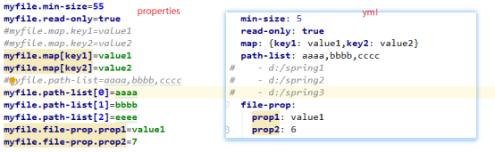

# Springboot
* 配置简单：**约定大于配置**
* 默认值→组件的注册→如果没有告诉应用配置的值，采用默认(约定)的值配置；如果告诉了配置的参数，以自己配置的参数为主
* 不需要额外的javaee容器(比如tomcat)，内置了tomcat，可以直接通过jar包启动
# Springboot基本使用
## 搭建Springboot应用


idea中和start.spring.io一致

如果没有使用某个框架，不要一股脑的选中乱七八糟的框架：自动配置(约定大于配置)

## 基本配置
```yml
#context-path
server.servlet.context-path=/demo1
#server-port
server.port=80
#springboot整合组件的配置写在配置文件中
```
根据文件名去加载配置文件

## yml配置文件
Properties配置文件转换成yml

当你遇到“.”转换成“：+换行+空格（任意个）”

“=”替换成“：空格（一个）”

## 给组件的成员变量赋值
赋随机值时，重新访问不会改变，重启服务器会改变

既可以使用properties，又可以使用yml


## @ConfigurationProperties(重要)
Springboot去实现自动配置中会经常使用的一个注解

打通组件成员变量和配置文件之间的联系


自动提示的插件
```xml
<dependency>
    <groupId>org.springframework.boot</groupId>
    <artifactId>spring-boot-configuration-processor</artifactId>
    <optional>true</optional>
</dependency>
```

赋值类型




## profiles
* yml中 通过---来区分多个配置文件
* 配置文件的名字：使用spring.profiles来配置
### profiles优先级
1. 命令行优先级是最高的
2. -file:.(jar包所在目录的)/config/  
3. -file:.(jar包所在目录的)/     
4. -classpath:/config
5. -classpath:/

## 注解
```java
// 注册mapper包下的所有mapper类到容器中
@MapperScan(basePackages = "com.cskaoyan.mapper")
public class DemoApplication {
    public static void main(String[] args) {
        SpringApplication.run(DemoApplication.class, args);
    }
}
```

# 原理
@SpringBootApplication等价于   
* SpringBootConfigaration
* EnableAutoConfigaration(允许进行自动配置)
* ComponentScan

/META-INF/spring.factories   
* 源码中：如果你没有注册→帮你注册(自动配置)

/META-INF/spring-configuration-metadata.json   
* 文件中：自动配置的一些属性(默认值)
