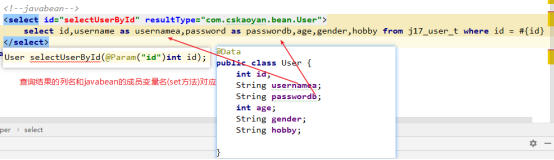
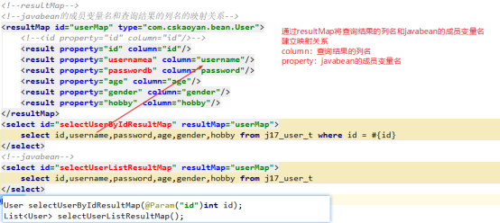

# 引入依赖
```xml
<dependency>
    <groupId>log4j</groupId>
    <artifactId>log4j</artifactId>
    <version>1.2.17</version>
</dependency>
```
# log4j的配置文件

# Pattern Layout
```xml
log4j.appender.stdout.layout.ConversionPattern=%d{ABSOLUTE} %5p %c{6}:%L - %m%n
```
* d： date时间
* p： privilege：日志级别 debug、info、warn、error、fatal
* c： class 
* L： Line行号：代码的行号
* m： message 日志的正文
* n： 换行
# 输入映射
## 单个参数
### 值类型
```java
Integer insertAccount(String name);
```
```xml
<!-- 单个参数：#{}里可以填任意参数 -->
<insert id="insertAccount">
    insert into accounts(name) values (#{name})
</insert>
```
### Javabean
```java
Accounts selectAccountAnnotation(User user);
```
```xml
<!-- 单个参数：javabean类型#{}里填的是javabean的成员变量名(实际上是调用的set方法) -->
<select id="selectAccountAnnotation" resultType="com.cskaoyan.bean.Accounts">
    select * from accounts where id = #{name}
</select>
```
### Map
```java
Map<String, Object> map = new HashMap<String, Object>();
map.put("id",1);

int selectUser(Map map);
```xml
<!-- 单个参数：map对象#{}里填map的key -->
<select id="selectUser">
    select * from accounts where id = #{id}
</select>
```
## 多个参数
### 多个值类型
```java
Integer insertAccountsAnnotation( String name, double balance);
```
```xml
<!-- 多个参数：基本类型，#{}里可以填的值为arg或param，arg下标从0开始，param下标从1开始 -->
<insert id="insertAccountsAnnotation">
    insert into accounts(name,balance) values (#{arg0},#{arg1})
</insert>
```
### 多个javabean
```java
Accounts insertDoubleUser(User user1, User user2, User user3);
```
```xml
<!-- 多个参数：javabean使用的仍然是arg或者param -->
<insert id="insertDoubleUser">
    insert into j17_user_t (username,password,age,gender,hobby) values
    (#{arg0.username},#{arg0.password},#{arg0.age},#{arg0.gender},#{arg0.hobby}),
    (#{arg1.username},#{arg1.password},#{arg1.age},#{arg1.gender},#{arg1.hobby}),
    (#{arg2.username},#{arg2.password},#{arg2.age},#{arg2.gender},#{arg2.hobby})
</insert>
```
### 多个混合类
```java
int insertMultyTypeParameterUser(String username, Map map, User user);
```
```xml
<!-- 混合类型：值类型直接用，map对象使用key，javabean使用成员变量名 -->
<insert id="insertMultyTypeParameterUser">
    insert into j17_user_t (username,password,age,gender,hobby) values
    (#{param1},#{param2.password},#{param2.age},#{param3.gender},#{param3.hobby})
</insert>
```
## 使用注解(最容易去使用)
@Param

接口的形参

**可见即可用**

**可见：@Param中写的值是什么**

**可用：#{}里可以使用的值**
# 输出映射
## 值类型
### 单个结果
直接接收
### 多个结果
数组或者List接收
```java
List<Accounts> accounts = mapper.selectAccounts();
```
多个结果和单个结果

在于sql语句的查询的记录数的不同

单条：0或1

多条：大于等于0

## javabean
### 单个javabean

### 多个javabean
## resultMap
主要是封装javabean使用的

让查询结果的列名和javabean的成员变量名产生映射关系




