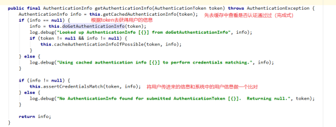

# shiro(声明式的)
**Security Manager**


# 使用
## 导入依赖
```xml
<dependency>
    <groupId>org.apache.shiro</groupId>
    <artifactId>shiro-core</artifactId>
    <version>1.4.1</version>
</dependency>
<dependency>
    <groupId>commons-logging</groupId>
    <artifactId>commons-logging</artifactId>
    <version>1.2</version>
</dependency>
```
## shiro认证流程


shiro-realm.ini配置文件
```ini
// shiro配置类
customRealm=com.cskaoyan.shiro.CustomRealm
securityManager.realm=$customRealm
```
自定义Realm类：
```java
public class CustomRealm extends AuthorizingRealm {

    //认证
    @Override
    protected AuthenticationInfo doGetAuthenticationInfo(AuthenticationToken authenticationToken) throws AuthenticationException {
        UsernamePasswordToken token = (UsernamePasswordToken) authenticationToken;
        String username = token.getUsername();

        // 到数据库查询
        String passwordFromDb = queryPasswordByUsername(username);
        //要包括一个真实的密码
        //1、primaryPrincipal信息，给授权信息传递参数
        //2、该用户从数据库查询的密码信息
        //3、realm的名字
        User user = new User();
        user.setUsername(username);
        SimpleAuthenticationInfo authenticationInfo = new SimpleAuthenticationInfo(user, passwordFromDb, getName());
        return authenticationInfo;
    }

    //授权
    @Override
    protected AuthorizationInfo doGetAuthorizationInfo(PrincipalCollection principalCollection) {
        User primaryPrincipal = (User) principalCollection.getPrimaryPrincipal();
        //获得用户信息
        //赋予当前用户对应的角色和权限
        String username = primaryPrincipal.getUsername();
        SimpleAuthorizationInfo authorizationInfo = new SimpleAuthorizationInfo();
        //告诉他当前用户所拥有的角色有哪些
        //所具备的权限有哪些
        //基于角色的授权模型
        Collection<String> roles = queryRolesByName(username);
        authorizationInfo.addRoles(roles);
        //基于权限的授权模型
        Collection<String> permissions = queryPermissionsByName(username);
        authorizationInfo.addStringPermissions(permissions);

        return authorizationInfo;
    }
}
```

使用：
```java
@Test
public void mytest1(){
    IniSecurityManagerFactory factory = new IniSecurityManagerFactory("classpath:shiro-realm.ini");
    SecurityManager securityManager = factory.getInstance();
    SecurityUtils.setSecurityManager(securityManager);
    Subject subject = SecurityUtils.getSubject();

    UsernamePasswordToken authenticationToken = new UsernamePasswordToken("songge","zhenshuai");
    subject.login(authenticationToken);
    boolean authenticated = subject.isAuthenticated();
    System.out.println(authenticated);

    ArrayList<String> list = new ArrayList<>();
    list.add("role1");
    list.add("role2");
    list.add("role3");
    boolean[] hasRoles = subject.hasRoles(list);
    System.out.println(Arrays.toString(hasRoles));

    boolean[] permitted = subject.isPermitted("user:insert","user:delete","user:update","user:query");
    System.out.println(Arrays.toString(permitted));
}
```
## 认证流程
代码的执行流程如下：
1. 通过ini配置文件创建securityManager
2. 调用subject.login方法主体提交认证，提交的token
3. securityManager进行认证，securityManager最终由ModularRealmAuthenticator进行认证。
4. ModularRealmAuthenticator调用IniRealm(给realm传入token) 去ini配置文件中查询用户信息
5. IniRealm根据输入的token（UsernamePasswordToken）从 shiro-first.ini查询用户信息，根据账号查询用户信息（账号和密码）   
如果查询到用户信息，就给ModularRealmAuthenticator返回用户信息（账号和密码）   
如果查询不到，就给ModularRealmAuthenticator返回null
6. ModularRealmAuthenticator接收IniRealm返回Authentication认证信息   
   * 如果返回的认证信息是null，ModularRealmAuthenticator抛出异常（org.apache.shiro.authc.UnknownAccountException）   
   * 如果返回的认证信息不是null（说明inirealm找到了用户），对IniRealm返回用户密码 （在ini文件中存在）和 token中的密码 进行对比，如果不一致抛出异常（org.apache.shiro.authc.IncorrectCredentialsException）
  


# 整合spring boot


