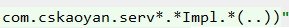
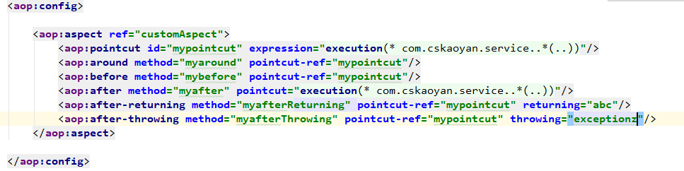
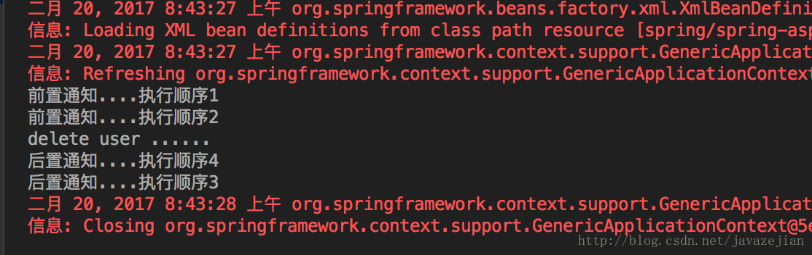
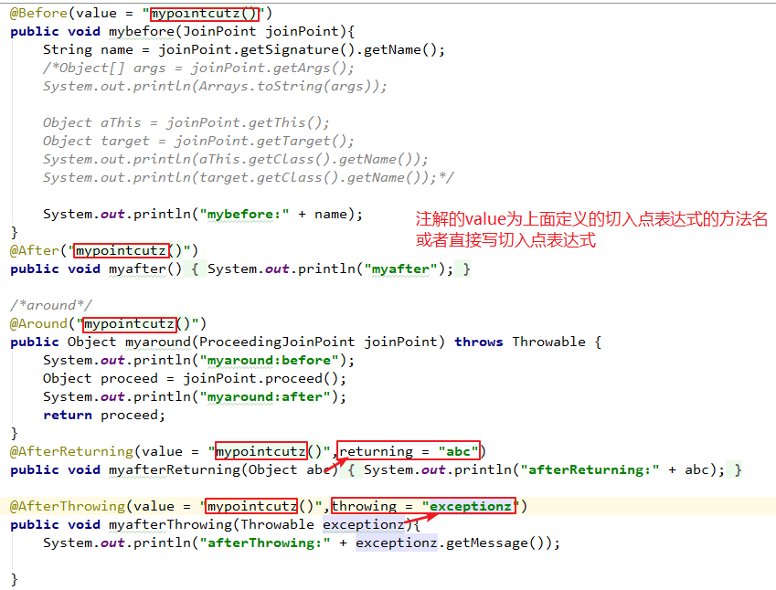
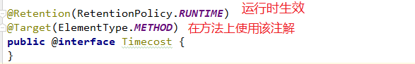
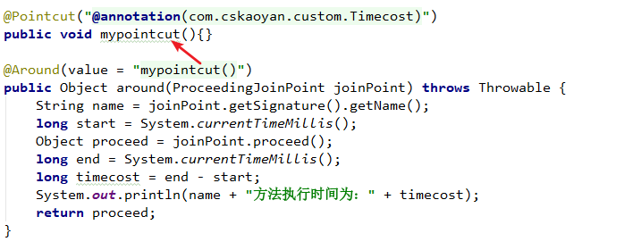

# AOP 面相切面编程
### 特点
AOP采取横向抽取机制，取代了传统纵向继承体系重复性代码

Spring AOP使用纯Java实现，不需要专门的编译过程和类加载器，在运行期通过代理方式向目标类织入增强代码
### 应用
事务管理、性能监视、安全检查、缓存 、日志等

想象一下如果每个组件都单独去实现这些系统功能：
* 改变这些关注点的逻辑，修改各个模块当中的实现，方法的调用就会重复出现在各个模块中
* 组件会因为那些与自身核心业务无关的代码而变得混乱
## AOP编程术语
1. Target   
目标类、被代理类 HouseOwner
2. JoinPoint   
连接点（待定）
3. **Pointcut**   
切入点   
标记要增强的方法   
切入点表达式：匹配性   
**谁：哪一个哪一些方法**
4. **Advice**   
通知：**在什么时间做什么事情**   
时间：相对于要被增强的方法（method.invoke）   
事情：具体的代码具体的业务
5. Weaver   
织入：动词Proxy
6. **Aspect**   
Pointcut+Advice：通知谁在什么时间做什么事情
## SpringAop
构建Service

创建一个自定义的通知类

在application.xml中生产一个代理对象
```xml
<!-- 在容器中注册通知类 -->
<bean id="customAdvice" class="com.cskaoyan.advice.CustomAdvice"/>
<!-- 在容器中注册Service类 -->
<bean id="userService" class="com.cskaoyan.service.UserServiceImpl"/>

<!-- 生成代理类 id为代理类的名称 -->
<bean id="userProxy" class="org.springframework.aop.framework.ProxyFactoryBean">
    <!-- target表示目标类 -->
    <property name="target" ref="userService"/>
    <!-- interceptorNames表示实现的增强类 -->
    <property name="interceptorNames" value="customAdvice"/>
</bean>
```
最后在单元测试中取出代理对象(用id的形式)
```xml
@Resource(name = "userProxy")
UserService userService;
```
## AspectJ
### **切入点表达式(重要)**
execution(修饰符 返回值 包名.类名.方法名(方法的参数) ~~throws Exception~~)
#### 修饰符
public

可以省略，不写就是代表任意的修饰符

#### 返回值
不能省略

使用*来通配，代表任意类型的返回值

int long Double Integer String....  基本类型和java.lang目录下的类名可以直接写类型

其他的类型要写全名
#### 包名+类名+方法名
能部分省略，除了头和尾都可以省略，使用..来进行省略

可以通配，*通配一个包名或者类名或者方法名，也可以通配一个单词的一部分,例如：


#### 参数
能省略，省略代表的是无参的方法

可以通配，(*)表示单个参数的方法，同理两个星为两个参数的方法

参数要求和返回值的要求相同，int long Double Integer String....  基本类型和java.lang目录下的类名可以直接写类型

(..)代表任意参数
### javaconfig

### 5种通知函数


首先定义一个切面方法(切入点)
可以在通知注解中直接写需要通知的方法
也可以自定义注解，然后在需要通知的方法上加入自定义注解


1. 前置通知@Before

前置通知通过@Before注解进行标注，并可直接传入切点表达式的值，该通知在目标函数执行前执行，注意JoinPoint，是Spring提供的静态变量，通过joinPoint 参数，可以获取目标对象的信息,如类名称,方法参数,方法名称等，，该参数是可选的。
```java
/**
 * 前置通知
 * @param joinPoint 该参数可以获取目标对象的信息,如类名称,方法参数,方法名称等
 */
@Before("execution(* com.zejian.spring.springAop.dao.UserDao.addUser(..))")
public void before(JoinPoint joinPoint){
    System.out.println("我是前置通知");
}
```
2. 后置通知@AfterReturning

通过@AfterReturning注解进行标注，该函数在目标函数执行完成后执行，并可以获取到目标函数最终的返回值returnVal，当目标函数没有返回值时，returnVal将返回null，必须通过returning = “returnVal”注明参数的名称而且必须与通知函数的参数名称相同。请注意，在任何通知中这些参数都是可选的，需要使用时直接填写即可，不需要使用时，可以完成不用声明出来。
```java
/**
* 后置通知
* returnVal,切点方法执行后的返回值(可省略)
*/
@AfterReturning(value="execution(* com.zejian.spring.springAop.dao.UserDao.*User(..))",returning = "returnVal")
public void AfterReturning(JoinPoint joinPoint,Object returnVal){
   System.out.println("我是后置通知...returnVal+"+returnVal);
}
```
3. 异常通知@afterThrowing

该通知只有在异常时才会被触发，并由throwing来声明一个接收异常信息的变量，同样异常通知也用于Joinpoint参数，需要时加上即可，如下：
```java
/**
* 抛出通知
* @param e 抛出异常的信息
*/
@AfterThrowing(value="execution(* com.zejian.spring.springAop.dao.UserDao.addUser(..))",throwing = "e")
//参数类型可以是Throwable也可以是Exception
public void afterThrowable(Throwable e){
  System.out.println("出现异常:msg="+e.getMessage());
}
```
4. 最终通知@After

该通知有点类似于finally代码块，只要应用了无论什么情况下都会执行。
```java
/**
 * 无论什么情况下都会执行的方法
 * joinPoint 参数
 */
@After("execution(* com.zejian.spring.springAop.dao.UserDao.*User(..))")
public void after(JoinPoint joinPoint) {
    System.out.println("最终通知....");
}
```
5. 环绕通知@Around

环绕通知既可以在目标方法前执行也可在目标方法之后执行，更重要的是环绕通知可以控制目标方法是否指向执行，但即使如此，我们应该尽量以最简单的方式满足需求，在仅需在目标方法前执行时，应该采用前置通知而非环绕通知。案例代码如下第一个参数必须是ProceedingJoinPoint，通过该对象的proceed()方法来执行目标函数，proceed()的返回值就是环绕通知的返回值。同样的，ProceedingJoinPoint对象也是可以获取目标对象的信息,如类名称,方法参数,方法名称等等。
```java
@Around("execution(* com.zejian.spring.springAop.dao.UserDao.*User(..))")
public Object around(ProceedingJoinPoint joinPoint) throws Throwable {
    System.out.println("我是环绕通知前....");
    //执行目标函数
    Object obj= (Object) joinPoint.proceed();
    System.out.println("我是环绕通知后....");
    return obj;
}
```
### 5种通知函数的联系与区别
* 都包含method和pointcut（-ref）属性
* afterReturning和afterThrowing分别多一个returning和throwing 属性
* 除了Around通知方法为Object，其余均为void
* 方法中参数都可以包含JoinPoint的类型，注意around为ProceedingJoinPoint
### Aspect优先级
```java
@Aspect
public class AspectOne {

    /**
     * Pointcut定义切点函数
     */
    @Pointcut("execution(* com.zejian.spring.springAop.dao.UserDao.deleteUser(..))")
    private void myPointcut(){}

    @Before("myPointcut()")
    public void beforeOne(){
        System.out.println("前置通知....执行顺序1");
    }

    @Before("myPointcut()")
    public void beforeTwo(){
        System.out.println("前置通知....执行顺序2");
    }

    @AfterReturning(value = "myPointcut()")
    public void AfterReturningThree(){
        System.out.println("后置通知....执行顺序3");
    }

    @AfterReturning(value = "myPointcut()")
    public void AfterReturningFour(){
        System.out.println("后置通知....执行顺序4");
    }
}
```
在同一个切面中定义多个通知响应同一个切点函数，执行顺序为声明顺序：



如果在不同的切面中定义多个通知响应同一个切点，进入时则优先级高的切面类中的通知函数优先执行，退出时则最后执行
### 注解来使用Aspectj
#### 打开注解开关
```xml
<aop:aspectj-autoproxy />
```
#### 新建一个切面类
切面类不需要实现接口和继承类，需要把它注册到容器中

在切面类之上新增一个@Aspect注解
#### 切入点
新增对应的方法，并且在方法上新增切入点表达式
```java
@Pointcut("execution(* com.cskaoyan.service..*(..))")
//方法名作为pointcut的id来使用
public void mypointcut(){}
```
#### 通知
在对应的通知上增加注解


### 自定义注解
#### 打开注解开关
```xml
<aop:aspectj-autoproxy />
```
#### 自定义一个注解

#### 配置切入点
```java
//@annotation中的值为注解的全类名
@Pointcut("@annotation(com.cskaoyan.custom.Timecost)")
public void mypointcut(){}
```
#### 使用通知



