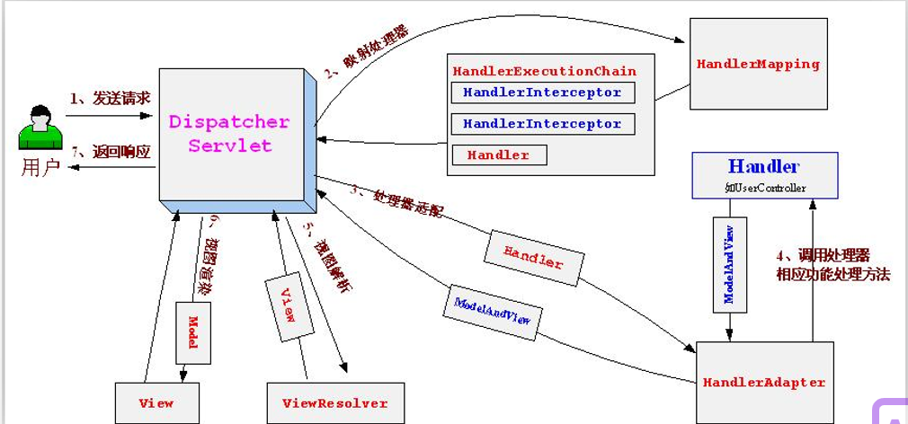

## SpringMVC
# @RequestMapping注解及其属性
## 使用@RequestMapping来映射Request请求与处理器
SpringMVC使用@RequestMapping注解为控制器制定可以处理哪些URL请求

在控制器的类定义及方法定义处都可以标注

* 类定义处：提供初步的请求映射信息。相对于WEB应用的根目录
* 方法处：提供进一步的细分映射信息。相对于类定义处的URL，若类定义处未标注@RequestMapping，则方法处标记的URL相对于WEB应用的根目录。
```java
@Controller
//此处value可省略
@RequestMapping(value="/test")
public class UserController{
@RequestMapping(value="/view",method = RequestMethod.GET)
public String index(){
    System.out.println("进来了");
    return "index";
}
}
```
## method属性
```java
@RequestMapping (value= "testMethod" , method={RequestMethod. GET , RequestMethod. DELETE })
public String testMethod() {
    return "method" ;
}
```
在上面的代码中就使用method 参数限制了以GET 或DELETE 方法请求/testMethod 的时候才能访问到该Controller 的testMethod 方法。
## headers属性
```java
@RequestMapping (value= "testHeaders" , headers={ "host=localhost" , "Accept" })
public String testHeaders() {
    return "headers" ;
}
```
headers 属性的用法和功能与params 属性相似。在上面的代码中当请求/testHeaders 的时候只有当请求头包含Accept 信息，且请求的host 为localhost 的时候才能正确的访问到testHeaders 方法。

# SpringMVC各接口解释
## DispatcherServlet接口
Spring提供的前端控制器，所有的请求都有经过它来统一分发。在DispatcherServlet将请求分发给Spring Controller之前，需要借助于Spring提供的HandlerMapping定位到具体的Controller。
## HandlerMapping接口
能够完成客户请求到Controller映射。
## Controller接口
需要为并发用户处理上述请求，因此实现Controller接口时，必须保证线程安全并且可重用。

Controller将处理用户请求，这和Struts Action扮演的角色是一致的。一旦Controller处理完用户请求，则返回ModelAndView对象给DispatcherServlet前端控制器，ModelAndView中包含了模型（Model）和视图（View）。

从宏观角度考虑，DispatcherServlet是整个Web应用的控制器；从微观考虑，Controller是单个Http请求处理过程中的控制器，而ModelAndView是Http请求过程中返回的模型（Model）和视图（View）。
## ViewResolver接口
Spring提供的视图解析器（ViewResolver）在Web应用中查找View对象，从而将相应结果渲染给客户。
# SpringMVC运行原理


1. 客户端请求提交到DispatcherServlet
2. 由DispatcherServlet控制器查询一个或多个HandlerMapping，找到处理请求的Controller
3. DispatcherServlet将请求提交到Controller
4. Controller调用业务逻辑处理后，返回ModelAndView
5. DispatcherServlet查询一个或多个ViewResoler视图解析器，找到ModelAndView指定的视图
6. 视图负责将结果显示到客户端

DispatcherServlet是整个Spring MVC的核心。它负责接收HTTP请求组织协调Spring MVC的各个组成部分。其主要工作有以下三项：

1. 截获符合特定格式的URL请求。
2. 初始化DispatcherServlet上下文对应的WebApplicationContext，并将其与业务层、持久化层的WebApplicationContext建立关联。
3. 初始化Spring MVC的各个组成组件，并装配到DispatcherServlet中。
## web.xml配置
```xml
<servlet>
    <servlet-name>dispatcher</servlet-name>
    <servlet-class>org.springframework.web.servlet.DispatcherServlet</servlet-class>
    <init-param>
        <param-name>contextConfigLocation</param-name>
        <param-value>classpath:application.xml</param-value>
    </init-param>
</servlet>
<servlet-mapping>
    <servlet-name>dispatcher</servlet-name>
    <url-pattern>/</url-pattern>
</servlet-mapping>
```
配置的时候还指明了contextConfigLocation，这样就会去加载这个applicationContext.xml了。
## applicationContext.xml配置
```xml
<!-- 注解驱动 -->
<context:component-scan base-package="com.cskaoyan"/>

<!-- 自动扫描 -->
<mvc:annotation-driven />

<!-- 视图解析器配置 -->
<bean class="org.springframework.web.servlet.view.InternalResourceViewResolver">
    <!-- 前缀 -->
    <property name="prefix" value="/WEB-INF/pages/"/>
    <!-- 后缀 -->
    <property name="suffix" value=".jsp"/>
</bean>
```
```java
//java代码中的返回值
return "index";
```
最后指向的是/WEB-INF/pages/index.jsp页面
# 以@RequestMapping标记的处理器方法支持的方法参数和返回类型
## 支持的方法参数类型
* HttpServlet 对象，主要包括HttpServletRequest 、HttpServletResponse 和HttpSession 对象。 这些参数Spring 在调用处理器方法的时候会自动给它们赋值，所以当在处理器方法中需要使用到这些对象的时候，可以直接在方法上给定一个方法参数的申明，然后在方法体里面直接用就可以了。但是有一点需要注意的是在使用HttpSession 对象的时候，如果此时HttpSession 对象还没有建立起来的话就会有问题。
* Spring 自己的WebRequest 对象。 使用该对象可以访问到存放在HttpServletRequest 和HttpSession 中的属性值。
* InputStream 、OutputStream 、Reader 和Writer 。 InputStream 和Reader 是针对HttpServletRequest 而言的，可以从里面取数据；OutputStream 和Writer 是针对HttpServletResponse 而言的，可以往里面写数据。
* 使用@PathVariable 、@RequestParam 、@CookieValue 和@RequestHeader 标记的参数。
* 使用@ModelAttribute 标记的参数。
* java.util.Map 、Spring 封装的Model 和ModelMap 。 这些都可以用来封装模型数据，用来给视图做展示。
* 实体类。 可以用来接收上传的参数。
* Spring 封装的MultipartFile 。 用来接收上传文件的。
* Spring 封装的Errors 和BindingResult 对象。 这两个对象参数必须紧接在需要验证的实体对象参数之后，它里面包含了实体对象的验证结果。
## 支持的返回类型
* 一个包含模型和视图的ModelAndView 对象。
* 一个模型对象，这主要包括Spring 封装好的Model 和ModelMap ，以及java.util.Map ，当没有视图返回的时候视图名称将由RequestToViewNameTranslator 来决定。
* 一个View 对象。这个时候如果在渲染视图的过程中模型的话就可以给处理器方法定义一个模型参数，然后在方法体里面往模型中添加值。
* 一个String 字符串。这往往代表的是一个视图名称。这个时候如果需要在渲染视图的过程中需要模型的话就可以给处理器方法一个模型参数，然后在方法体里面往模型中添加值就可以了。
* 返回值是void 。这种情况一般是我们直接把返回结果写到HttpServletResponse 中了，如果没有写的话，那么Spring 将会利用RequestToViewNameTranslator 来返回一个对应的视图名称。如果视图中需要模型的话，处理方法与返回字符串的情况相同。
* 如果处理器方法被注解@ResponseBody 标记的话，那么处理器方法的任何返回类型都会通过HttpMessageConverters 转换之后写到HttpServletResponse 中，而不会像上面的那些情况一样当做视图或者模型来处理。
* 除以上几种情况之外的其他任何返回类型都会被当做模型中的一个属性来处理，而返回的视图还是由RequestToViewNameTranslator 来决定，添加到模型中的属性名称可以在该方法上用@ModelAttribute(“attributeName”) 来定义，否则将使用返回类型的类名称的首字母小写形式来表示。使用@ModelAttribute 标记的方法会在@RequestMapping 标记的方法执行之前执行。

# 使用@ModelAttribute 和 @SessionAttributes 传递和保存数据
SpringMVC 支持使用 @ModelAttribute 和 @SessionAttributes 在不同的模型和控制器之间共享数据。 @ModelAttribute 主要有两种使用方式，一种是标注在方法上，一种是标注在 Controller 方法参数上。

当 @ModelAttribute 标记在方法上的时候，该方法将在处理器方法执行之前执行，然后把返回的对象存放在 session 或模型属性中，属性名称可以使用 @ModelAttribute(“attributeName”) 在标记方法的时候指定，若未指定，则使用返回类型的类名称（首字母小写）作为属性名称。

当 @ModelAttribute 标记在处理器方法参数上的时候，表示该参数的值将从模型或者 Session 中取对应名称的属性值，该名称可以通过 @ModelAttribute(“attributeName”) 来指定，若未指定，则使用参数类型的类名称（首字母小写）作为属性名称。

# 参数封装
## 直接封装
input标签中的name与形参的参数名一致

直接获取参数需要注意

* 不要用int等基本数据类型，因为有可能前端会返回空字符串，基本数据类型会报错
* 布尔类型不要用boolean去接收，要用Boolean，因为boolean自动生成的set方法名为 is...()，Boolean生成的set方法为 set...()

## Javabean形式封装
* input标签的name值与javabean的成员变量名对应（set方法）
* javabean中有javabean的情况，前端name写为"user.age"，表示user对象中的age属性
## 数组形式封装
* input标签的name值是一致
* 请求中参数名是一致hobbys=sing&hobbys=jump&hobbys=rap
## list形式
* 值类型   
前端name属性中:hobbyList[0]
* Javabean类型   
前端name属性中:userDetailList[0].mobile&userDetailList[0].height&userDetailList[1].mobile&userDetailList[0].height
# 文件上传
## 注册组件
```xml
<!--id一定要写，并且要写multipartResolver-->
 <bean id="multipartResolver" class="org.springframework.web.multipart.commons.CommonsMultipartResolver"/>
 ```
 形参参数类型为MultipartFile类型 前端name属性中的值必须与形参参数名一致
 ```java
 @RequestMapping("/user/login")
public ModelAndView login( MultipartFile file){
    try {
        File file = new File(E:/upload/ + file.getOriginalFilename());
        // 写入本地
        file.transferTo(file);
    } catch (IOException e) {
        e.printStackTrace();
    }
    return /ok.jsp
}
 ```
 # 类型转换
 ```xml
 <mvc:annotation-driven conversion-service="customConversionService"/>
<!--转换器-->
<bean id="customConversionService" class="org.springframework.format.support.FormattingConversionServiceFactoryBean">
    <property name="converters">
        <set>
            <!--<bean class="com.cskaoyan.converter.String2DateConverter"/>-->
            <ref bean="string2DateConverter"/>
        </set>
    </property>
</bean>
```
String类型转换为Date
```java
@Component
public class StringToDateConverter implements Converter<String, Date> {
    @Override
    public Date convert(String s) {
        SimpleDateFormat simpleDateFormat = new SimpleDateFormat("yyyy-MM-dd");
        Date parse = null;
        try {
            parse = simpleDateFormat.parse(s);
        } catch (ParseException e) {
            e.printStackTrace();
        }
        return parse;
    }
}
```
# 请求中文乱码
```xml
<filter>
    <filter-name>characterEncodingFilter</filter-name>
    <!-- 必须是CharacterEncodingFilter -->
    <filter-class>org.springframework.web.filter.CharacterEncodingFilter</filter-class>
    <init-param>
        <param-name>encoding</param-name>
        <!-- 编码格式 -->
        <param-value>utf-8</param-value>
    </init-param>
</filter>
<filter-mapping>
    <filter-name>characterEncodingFilter</filter-name>
    <!-- 作用范围 -->
    <url-pattern>/*</url-pattern>
</filter-mapping>
```


