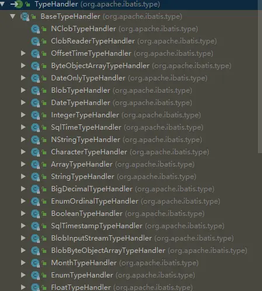

## 概述

`TypeHandler`是 `Mybatis `中用来将java数据类型中和数据库类型进行相互转化的， `mybatis `中已经帮我们封装了大量的类型处理器，够工作中使用了。一下为 `mybatis `中默认的类型处理器。含有处理日期类型的 `DateTypeHandler` ，处理字符类型的  `StringTypeHandler `等



但是遇到特殊情景就需要我们自定义类型处理器了。

## 实现方式

自定义 `typeHandler `有两种实现方式：

* 实现 `TypeHandler `接口
* 继承 `BaseTypeHandler `类

## 实现TypeHandler 接口

```java
@MappedTypes(String[].class)
@MappedJdbcTypes(JdbcType.VARCHAR)
public class String2ArrayTypeHandler implements TypeHandler<String[]> {
    
    /*输入映射*/
    @Override
    public void setParameter(PreparedStatement preparedStatement, int index, String[] strings, JdbcType jdbcType) throws SQLException {
        preparedStatement.setString(index,parseArray2String(strings));
    }


    /*输出映射*/
    @Override
    public String[] getResult(ResultSet resultSet, String columnName) throws SQLException {
        //根据列名获得数据
        String string = resultSet.getString(columnName);
        //将获得的数据转换成目标类型
        return parseString2Array(string);
    }

    @Override
    public String[] getResult(ResultSet resultSet, int index) throws SQLException {
        // 根据列的索引获得数据
        String string = resultSet.getString(index);
        return parseString2Array(string);
    }

    @Override
    public String[] getResult(CallableStatement callableStatement, int i) throws SQLException {
        String string = callableStatement.getString(i);
        return parseString2Array(string);
    }


    private String parseArray2String(String[] strings) {
        ObjectMapper objectMapper = new ObjectMapper();
        try {
            String s = objectMapper.writeValueAsString(strings);
            return s;
        } catch (JsonProcessingException e) {
            e.printStackTrace();
        }
        return null;
    }

    public String[] parseString2Array(String arrayString){
        ObjectMapper objectMapper = new ObjectMapper();
        String[] strings = new String[0];
        try {
            strings = objectMapper.readValue(arrayString, String[].class);
        } catch (JsonProcessingException e) {
            e.printStackTrace();
        }
        return strings;
    }
}
```