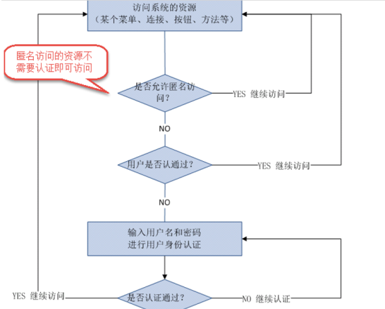
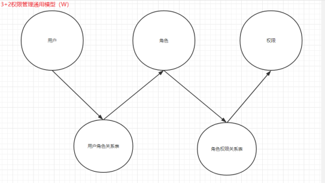
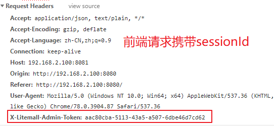
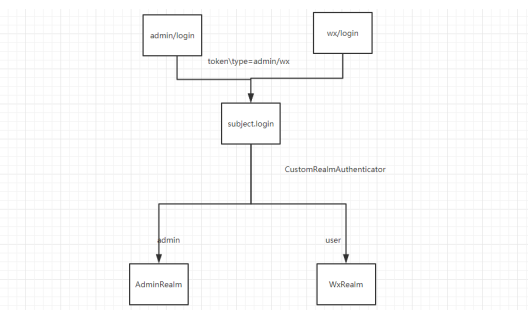
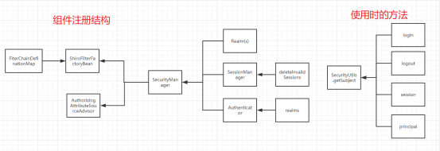
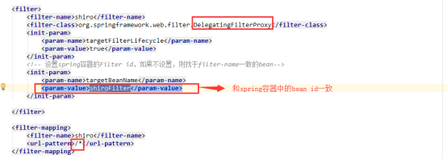

# 概念

## 认证(authenticate)

用户访问进我们的系统



* **Subject**：理解成用户，要通过它来执行认证 ，login的操作
* Principal：认证通过后获取的用户的信息
* Credential：执行认证的时候需要的一个凭证信息，通常是密码
* Subject.login(principal,credential)

## 授权(authorize) 

在认证通过后，授予某些资源的权限

用户首先赋予某一些权限，接着喝访问当前资源的权限进行对比，如果能够通过，则可以访问

执行授权的时候，首先拿到用户的信息 promcopal ,就可以根据这个身份信息去获得该用户的权限信息了，根据你获得的这个权限信息，判断你对什么资源（比如用户、商品）去能够做什么样的操作（比如新增、删除）

## 基本模型

用户和权限：多对多

## 通用模型



# shiro

## 核心组件

`SecurityManager`：

* `Authenticator`
* `Authorizer`

Realm（域）是还是用shiro的核心组件，在realm中获取认证和授权信息（来源于数据库）

## 认证流程

代码的执行流程如下：

1. 通过`ini`配置文件创建`securityManager`
2. 调用`subject.login`方法主体提交认证，提交`token`
3. `securityManager`进行认证，`securityManager`最终由`ModularRealmAuthenticator`进行认证
4. `ModularRealmAuthenticator`调用`IniRealm`(给`realm`传入`token`)去`ini`配置文件中查询用户信息
5. `IniRealm`根据输入的`token`（`UsernamePasswordToken`）从`shiro-first.ini`查询用户信息，根据账号查询用户信息（账号和密码）
6. `ModularRealmAuthenticator`接收`IniRealm`返回`Authentication`认证信息
   * 如果返回的认证信息是`null`，`ModularRealmAuthenticator`抛出异常（`org.apache.shiro.authc.UnknownAccountException`）
   * 如果返回的认证信息不是`null`（说明`inirealm`找到了用户），对`IniRealm`返回用户密码（在`ini`文件中存在）和`token`中的密码进行对比，如果不一致抛出异常（`org.apache.shiro.authc.IncorrectCredentialsException`）

## 自定义Realm信息处理

`Realm`→`IniRealm`（`doGetAuthenInfo ``doGetAuthorInfo`）→`CustomRealm`（`doGetAuthenInfo ``doGetAuthorInfo`）

### 创建自定义的realm

```java
public class CustomRealm extends AuthorizingRealm
```

提供了两个需要用户去实现的方法

* `doGetAuthenticationInfo`（获得认证信息）
* `doGetAuthorizationInfo`（获得授权信息）

**doGetAuthenticationInfo**

```java
@Override
protected AuthenticationInfo doGetAuthenticationInfo(AuthenticationToken authenticationToken) throws AuthenticationException {
    UsernamePasswordToken token = (UsernamePasswordToken) authenticationToken;
    String username = token.getUsername();
    //去数据库查询
    String passwordFromDb = queryPasswordByUsername(username);
    //要包括一个真实的密码
    //1、primaryPrincipal信息，给授权信息传递参数
    //2、该用户从数据库查询的密码信息
    //3、realm的名字
    User user = new User();
    user.setUsername(username);
    SimpleAuthenticationInfo authenticationInfo = new SimpleAuthenticationInfo(user, passwordFromDb, getName());
    return authenticationInfo;
}
```

**doGetAuthorizationInfo**

```java
@Override
protected AuthorizationInfo doGetAuthorizationInfo(PrincipalCollection principalCollection) {
    User primaryPrincipal = (User) principalCollection.getPrimaryPrincipal();
    //获得用户信息
    //赋予当前用户对应的角色和权限
    String username = primaryPrincipal.getUsername();
    SimpleAuthorizationInfo authorizationInfo = new SimpleAuthorizationInfo();
    //告诉他当前用户所拥有的角色有哪些
    //所具备的权限有哪些
    //数据库查询用户的角色是什么
    Collection<String> roles = queryRolesByName(username);
    authorizationInfo.addRoles(roles);
    //查询用户所拥有的权限
    Collection<String> permissions = queryPermissionsByName(username);
    authorizationInfo.addStringPermissions(permissions);
    return authorizationInfo;
}
```

# Springboot中整合shiro

`SecurityManager`中已经配置了`realm`、`ShiroFilterFactoryBean`

## 导包

```xml
<dependency>    
    <groupId>org.apache.shiro</groupId>    
    <artifactId>shiro-spring</artifactId>    
    <version>1.2.3</version>
</dependency>
```

## 自定义realm

```java
/**
 * 自定义realm处理认证和授权信息
 */
@Component
public class CustomRealm extends AuthorizingRealm {
    
    @Autowired
    UserMapper userMapper;
    
    //认证
    @Override
    protected AuthenticationInfo doGetAuthenticationInfo(AuthenticationToken authenticationToken) throws AuthenticationException {
        //获得登录用户信息
        UsernamePasswordToken token = (UsernamePasswordToken) authenticationToken;
        String username = token.getUsername();

        //根据获得的登录信息查询用户其他信息
        User user = userMapper.selectUserByName(username);
        String passwordFromDb = user.getPassword();
        //SimpleAuthenticationInfo中的参数：
        //user：执行完认证后，user会被存放在subject中
        //passwordFromDb：数据库中查询出的用户密码，底层会去判断是否和登录的密码相同
        //SimpleAuthenticationInfo执行完之后，就可以直接用subject获得user中存放的所有信息
        SimpleAuthenticationInfo authenticationInfo = new SimpleAuthenticationInfo(user, passwordFromDb, getName());

        return authenticationInfo;
    }
    
    //授权
    @Override
    protected AuthorizationInfo doGetAuthorizationInfo(PrincipalCollection principalCollection) {
        //获取认证后的用户信息
        User primaryPrincipal = (User) principalCollection.getPrimaryPrincipal();
        String username = primaryPrincipal.getUsername();
        //存入用户权限
        SimpleAuthorizationInfo authorizationInfo = new SimpleAuthorizationInfo();
        //此用户拥有的权限
        List<String> permissions = userMapper.selectPermissionByUsername(username);

//        authorizationInfo.addStringPermission("user:query");
        authorizationInfo.addStringPermissions(permissions);
        //存入此用户拥有的权限
        return authorizationInfo;
    }
}
```

## 组件注册

在`config`中注册`shiro`组件

* `ShiroFilterFactoryBean`
* `SecurityManager`

```java
@Configuration
public class ShiroConfig {
    
    //login → anon匿名
    //index → 认证之后才能访问
    //info
    //success

    /**
     * 配置整个shiroFilter，并把它注册到组件中
     */
    @Bean
    //参数securityManager注册在之后的代码中
    public ShiroFilterFactoryBean shiroFilterFactoryBean(DefaultWebSecurityManager securityManager){
        
        ShiroFilterFactoryBean shiroFilterFactoryBean = new ShiroFilterFactoryBean();
        shiroFilterFactoryBean.setSecurityManager(securityManager);
        //认证失败重定向的url
        shiroFilterFactoryBean.setLoginUrl("/admin/redirect");
        //配置的是拦截器 shiro提供的filter
        //这儿一定要使用linkedHashMap 否则，chain的顺序会有问题
        LinkedHashMap<String, String> filterChainDefinitionMap = new LinkedHashMap<>();
        //第一个参数是请求url 第二个参数是过滤器
        filterChainDefinitionMap.put("/login","anon");
        //filterChainDefinitionMap.put("/user/query","perms[user:query]");

        filterChainDefinitionMap.put("/**","authc");
        shiroFilterFactoryBean.setFilterChainDefinitionMap(filterChainDefinitionMap);
        return shiroFilterFactoryBean;
    }
    
    /*SecurityManager*/
    @Bean
    public DefaultWebSecurityManager securityManager(CustomRealm customRealm){
        DefaultWebSecurityManager securityManager = new DefaultWebSecurityManager();
        securityManager.setRealm(customRealm);
        return securityManager;
    }

    /*声明式鉴权*/
    @Bean
    public AuthorizationAttributeSourceAdvisor authorizationAttributeSourceAdvisor(DefaultWebSecurityManager securityManager){

        AuthorizationAttributeSourceAdvisor authorizationAttributeSourceAdvisor = new AuthorizationAttributeSourceAdvisor();
        authorizationAttributeSourceAdvisor.setSecurityManager(securityManager);
        return authorizationAttributeSourceAdvisor;
    }
}
```

## 声明式鉴权

### 导包

```xml
<dependency>    
    <groupId>org.aspectj</groupId>    
    <artifactId>aspectjweaver</artifactId>    
    <version>1.9.4</version>
</dependency>
```

### 组件注册

注册在之前的`ShiroConfig`中

```java
@Bean
public AuthorizationAttributeSourceAdvisor authorizationAttributeSourceAdvisor(DefaultWebSecurityManager securityManager){
    AuthorizationAttributeSourceAdvisor authorizationAttributeSourceAdvisor = new AuthorizationAttributeSourceAdvisor();
    authorizationAttributeSourceAdvisor.setSecurityManager(securityManager);
    return authorizationAttributeSourceAdvisor;
}
```

### 使用

```java
@RequestMapping("user/query")
//value的值为访问该请求所需要具备的权限
//logical的值为权限之间的关系
@RequiresPermissions(value = {"user:query","user:insert2"},logical = Logical.AND)
public BaseRespVo queryUser(){
    return BaseRespVo.ok("user");
}
```

# shiro在项目中的使用

设置完认证完成之后就可以在后端用户登录之后的模块里使用subject来获取用户信息

## SessionManager

自定义`sessionManager`保证跨域请求的`session`一致

### 将sessionId给到前端


### 将sessionId通过header形式携带到请求中



### 通过配置session管理器，从请求头中取出sessionId

```java
/**
 * 管理session 根据那个header去 
 * 跨域时，在登录完成后，需要给前段发送sessionId并保存，在跨域后，后端带着sessionId的时候前端会先去判断sessionId是否一致，这样可以保证跨域请求的session是否一致
 */
public class CustomSessionManager extends DefaultWebSessionManager {    
@Override    
    protected Serializable getSessionId(ServletRequest servletRequest, ServletResponse response) {        
        HttpServletRequest request = (HttpServletRequest) servletRequest; 
        //微信端请求
        String header = request.getHeader("X-mall-Admin-Token"); 
        //前端请求
        String Adminheader = request.getHeader("X-Litemall-Admin-Token");        
        if (header != null && !"".equals(header)){            
            return header;        
        }else if (Adminheader != null && !"".equals(Adminheader)){            
            return Adminheader;        
        }        
        return super.getSessionId(request, response);    
    }
}
```

### 注册组件

在之前的`ShiroConfig`中注册

```java
/**
 *
 * 注册这个sessionManager 并且设置了时间
 * @return 
 */
@Bean
public CustomSessionManager sessionManager(){
    CustomSessionManager customSessionManager = new CustomSessionManager();    
    customSessionManager.setDeleteInvalidSessions(true);    
    customSessionManager.setGlobalSessionTimeout(24*60*60*1000);
    return customSessionManager;
}
```

### 在后端获得用户信息

```java
@RequestMapping("info")
public BaseRespVo info(String token){
    Subject subject = SecurityUtils.getSubject();
    User user = (User) subject.getPrincipal();
}
```

## 多账号体系

通过`Token`中携带账号类型，分发给不同`realm`处理方式完成



### 自定义token

自定义的`token`中可以携带类型信息

```java
public class CustomToken extends UsernamePasswordToken {
    //定义一个类型
    String type;
    public CustomToken(String username, String password, String type) {
        super(username, password);        
        this.type = type;    
    }
}
```

请求时可以携带自定义的`token`信息

```java
//后台
@RequestMapping("/auth/login")
public BaseReqVo login(@RequestBody AdminDO adminDO){
    CustomToken admin = new CustomToken(adminDO.getUsername(), adminDO.getPassword(), "admin");
    subject.login(admin);
}
```

```java
//微信端
@RequestMapping("/auth/login")
public BaseReqVo login(@RequestBody AdminDO adminDO){
    CustomToken user = new CustomToken(userDO.getUsername(), userDO.getPassword(), "wx");
    subject.login(user);
}
```

### 自定义Authenticator

重写`doAuthenticate`方法，对`realms`信息进行狸猫换太子

```java
public class CustomRealmAuthenticator extends ModularRealmAuthenticator {
    @Override    
    protected AuthenticationInfo doAuthenticate(AuthenticationToken authenticationToken) throws AuthenticationException {
        this.assertRealmsConfigured();
        Collection<Realm> originRealms = this.getRealms();
        
        CustomToken token = (CustomToken) authenticationToken;
        String type = token.getType();
        ArrayList<Realm> realms = new ArrayList<>();
        for (Realm originRealm : originRealms) {
            //判断是那种类型
            if (originRealm.getName().toLowerCase().contains(type)){
                realms.add(originRealm);
            }
        }
        return realms.size() == 1 ? this.doSingleRealmAuthentication((Realm)realms.iterator().next(), authenticationToken) : this.doMultiRealmAuthentication(realms, authenticationToken);
    }
}
```

注册该组件的时候，配置其成员变量realms

```java
@Beanpublic
CustomRealmAuthenticator authenticator(AdminRealm adminRealm, WxRealm wxRealm){
    CustomRealmAuthenticator customRealmAuthenticator = new CustomRealmAuthenticator();
    ArrayList<Realm> realms = new ArrayList<>();
    realms.add(adminRealm);
    realms.add(wxRealm);  // 注册 两个Realm
    customRealmAuthenticator.setRealms(realms);
    return customRealmAuthenticator;
}
```

### 整体架构图



## SSM的情况（如有需要，可以去使用）

相对于springboot额外在web.xml中注册组件




