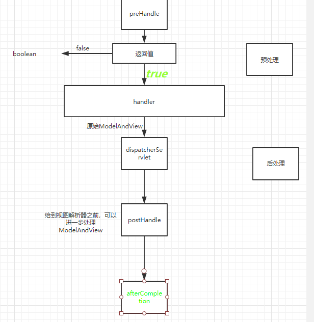

# Rest
可以直接把请求相关的属性直接写到url里，然后利用@RequestMapping来进行处理

user Delete请求

user/delete

https://blog.csdn.net/qq_36903042/article/details/102792114

qq_36903042为作者的用户名  102792114为文章id

## @PathVariable
```java
@RequestMapping("delete/{id}")
// @PathVariable("id")中的属性对应{id}
public String deleteUser(@PathVariable("id") Integer id){
    System.out.println("delete方法接收到的id为：" + id);
    return "/ok.jsp";
}
@RequestMapping("{username}/query/{id}")
// @PathVariable("id")中的属性对应{id}
// @PathVariable("username")中的属性对应{username}
public String query(@PathVariable("id") Integer id,
                    @PathVariable("username") String username){
    System.out.println("query方法接收到的id为：" + id);
    System.out.println("query方法接收到的username为：" + username);
    return "/ok.jsp";
}
```
输入的地址栏为：localhost/user/maxiao/query/45675
## @RequestHeader
```java
 @RequestMapping("/request/header")
 // @RequestHeader("Content-Type") 对应响应头中的Content-Type头
public String fetchRequestHeaderParameter(@RequestHeader("Content-Type") String contentType){
    System.out.println("接收到的content-type为：" + contentType);
    return "ok.jsp";
}
@RequestMapping("/request/header2")
// @RequestHeader("Accept") 对应响应头中的Accept头
public String fetchRequestHeaderParameter2(@RequestHeader("Accept") String[] accept){
    for (String s : accept) {
        System.out.println(s);
    }
    return "/ok.jsp";
}
```
## @RequestParam
```java
@RequestMapping("/request/param")
// 和requestMapping的params属性一致的功能
public String fetchRequestParameter(@RequestParam("username") String username){
    System.out.println("username = " + username);
    return "/ok.jsp";
}
```
## @CookieValue
```java
@RequestMapping("/request/cookie")
// 取得cookie中的type属性的值
public String fetchRequestCookie(@CookieValue("type") String type){
    System.out.println("type = " + type);
    return "/ok.jsp";
}
@RequestMapping("/put/session")
public String putSession(HttpSession session){
    session.setAttribute("songge","zhenshuai");
    System.out.println("session = " + session);
    return "/ok.jsp";
}
@RequestMapping("/request/session")
public String fetchRequestSession(HttpSession session){
    Object songge = session.getAttribute("songge");
    System.out.println("session = " + songge);
    return "/ok.jsp";
}
```

# 静态资源处理
## 默认的servlet
```xml
<servlet-mapping>
    <servlet-name>default</servlet-name>
    <url-pattern>*.jpg</url-pattern>
</servlet-mapping>
<servlet-mapping>
    <servlet-name>default</servlet-name>
    <url-pattern>*.css</url-pattern>
</servlet-mapping>
<servlet-mapping>
    <servlet-name>default</servlet-name>
    <url-pattern>*.js</url-pattern>
</servlet-mapping>
<servlet-mapping>
    <servlet-name>dispatcher</servlet-name>
    <url-pattern>/</url-pattern>
</servlet-mapping>
```
## 默认的处理器
```xml
<mvc:default-servlet-handler/>
```
## 映射的形式来处理静态资源
```xml
<!-- **表示包含此包及此包的下级目录 -->
<!-- 可以访问/WEB-INF/pic/下的静态文件，访问url为/pic/... -->
<mvc:resources mapping="/pic/**" location="/WEB-INF/pic/"/>
<!-- 可以访问classpath:/pic/下的静态文件，访问url为/pic2/... -->
<mvc:resources mapping="/pic2/**" location="classpath:/pic/"/>
<!-- 可以访问D:/spring/file/下的静态文件，访问url为/pic3/... -->
<mvc:resources mapping="/pic3/**" location="file:D:/spring/file/"/>
```
# HandlerInterceptor


## HandlerInterceptor接口
### preHandle
返回值

* true表示继续流程（如调用下一个拦截器或处理器）；

* false表示流程中断（如登录检查失败），不会继续调用其他的拦截器或处理器，此时我们需要通过response来产生响应；
### postHandle
后处理回调方法，实现处理器的后处理（但在渲染视图之前），此时我们可以通过modelAndView（模型和视图对象）对模型数据进行处理或对视图进行处理，modelAndView也可能为null
### afterCompletion
整个请求处理完毕回调方法，即在视图渲染完毕时回调，如性能监控中我们可以在此记录结束时间并输出消耗时间，还可以进行一些资源清理，类似于try-catch-finally中的finally，但仅调用处理器执行链中preHandle返回true的拦截器的afterCompletion。
## 使用HandlerInterceptor
### 注册一个Interceptor组件
```java
// 实现接口并注册组件
@Component
public class CustomHandlerInterceptor implements HandlerInterceptor {

}
```
### 配置给interceptors
```xml
<mvc:interceptors>
    <!-- 直接注册 -->
    <!--<bean class="com.cskaoyan.interceptor.CustomHandlerInterceptor"/>-->
    <!-- 引用容器中已有的组件 -->
    <ref bean="customHandlerInterceptor"/>
</mvc:interceptors>
```
## 执行顺序
1. preHandle
2. hello world
3. postHandle
4. afterCompletion
## 多个interceptorChain
Prehandle1 

prehandle2 

Helloworld

postHandle1

postHandle2

afterCompletion1

afterCompletion2

1. 执行顺序123321321…   123…nn…321n…321
2. 当当前的interceptor的prehandle返回值为true，name一定会执行到其afterCompletion方法
## Interceptor的作用范围
```xml
<mvc:interceptors>
    <!-- 对范围没有限制 -->
    <!--<bean class="com.cskaoyan.interceptor.CustomHandlerInterceptor"/>-->
    <ref bean="customHandlerInterceptor"/>
    <!-- 对部分请求进行作用 -->
    <mvc:interceptor>
        <!--path对应的是请求:这就是作用范围-->
        <mvc:mapping path="/user/**"/>
        <ref bean="customHandlerInterceptor3"/>
    </mvc:interceptor>
</mvc:interceptors>
```
# Exception
HandlerExceptionResolver

触发异常后的异常处理器
## 自定义的异常
自定义一个异常，继承Exception或者RuntimeException

异常中可以定义参数，用来接收导致异常的变量
## 代码中抛出某些异常（手动构造了一些异常）
throw new 自定义异常类名(message,自定义异常中的参数)
## 自定义异常处理器
实现HandlerExceptionResolver接口并且注册组件

核心功能：根据异常处理ModelAndView
```java
@Component
public class CustomExceptionHandlerResolver implements HandlerExceptionResolver {
    @Override
    public ModelAndView resolveException(HttpServletRequest httpServletRequest, HttpServletResponse httpServletResponse, Object o, Exception exception) {
        ModelAndView modelAndView = new ModelAndView();
        /*对异常做一些新的处理*/
        /*判断：异常的类型
        * 不同的异常做不同的业务逻辑*/
        // 判断是否属于自定义异常ParameterException
        if (exception instanceof ParameterException){
            // 转换以使用getParameter()方法
            ParameterException parameterException = (ParameterException) exception;
            String parameter = parameterException.getParameter();
            String message = parameterException.getMessage();
            modelAndView.setViewName("/exception/parameter.jsp");
            modelAndView.addObject("message",message);
            modelAndView.addObject("parameter",parameter);
        }else if (exception instanceof UnknownException){
            modelAndView.setViewName("/exception/unknown.jsp");
            modelAndView.addObject("message",exception.getMessage());
        }else {
            modelAndView.setViewName("/exception.jsp");
            modelAndView.addObject("message",exception.getMessage());
        }
        return modelAndView;
    }
}
```


