# Spring
## IOC
**Inverse of control（控制）**

控制反转

* 控制：实例的生成权
* 反转：将实例的控制权由应用程序反转给Spring

IOC的好处

1. 不用自己组装，拿来就用
2. 享受单例的好处，效率高，不浪费空间
3. 便于单元测试，方便切换mock组件
4. 便于进行AOP操作，对于使用者是透明的
5. 统一配置，便于修改

IOC的原理

* 原理就是通过Java的反射技术来实现的！通过反射我们可以获取类的所有信息(成员变量、类名等等等)！
* 再通过配置文件(xml)或者注解来描述类与类之间的关系
* 我们就可以通过这些配置信息和反射技术来构建出对应的对象和依赖关系了

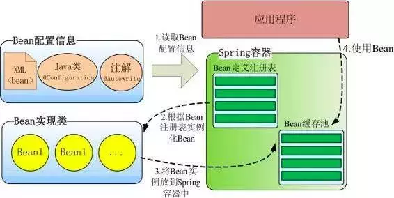

1. 根据Bean配置信息在容器内部创建Bean定义注册表
2. 根据注册表加载、实例化bean、建立Bean与Bean之间的依赖关系
3. 将这些准备就绪的Bean放到Map缓存池中，等待应用程序调用

## DI
**Dependency Injection**

依赖注入

* 依赖：组件中所包含的必须的资源(成员变量)
* 注入：Spring 注入给应用程序

谁依赖谁，为什么依赖，谁注入谁，注入了什么
# 入门案例
### 引入依赖
5 Spring+1logging

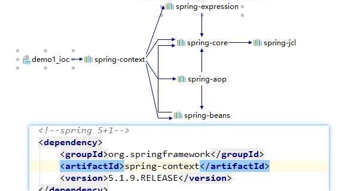
### Spring 配置文件
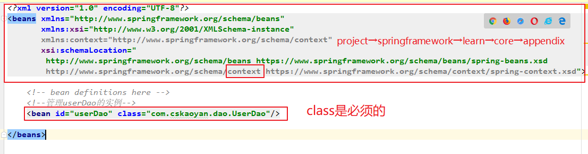
### 单元测试
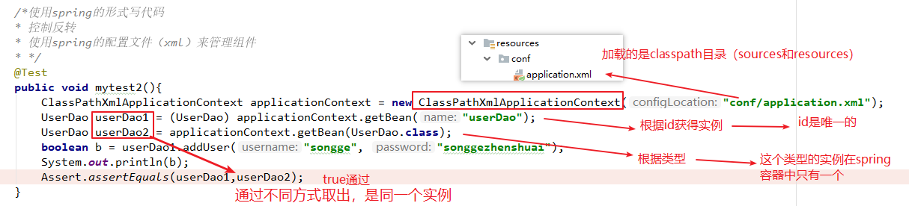
### 组件之间关系的维护
通过service和dao组件之间的关系，来维护组件之间的关系

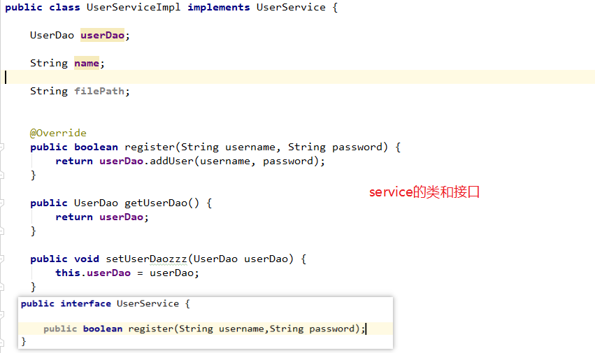

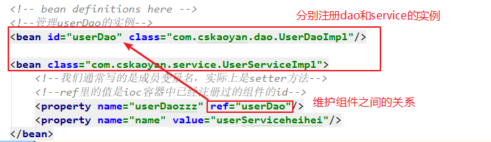

## 注册 bean
从容器中取出组件之前已经完成了实例化(生命周期)

默认是使用无参构造,也是最常用的

* 无参构造

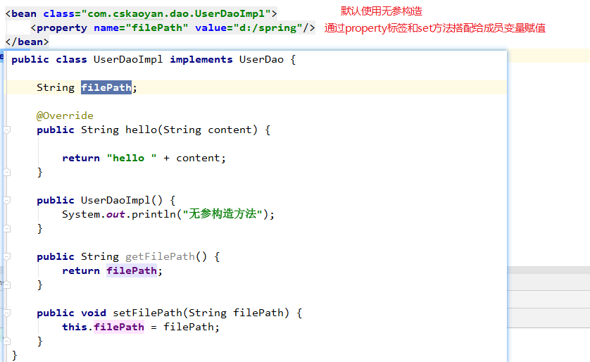

* 有参构造

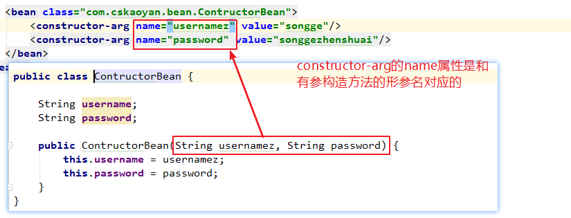
## 工厂
主要是整合其他组件

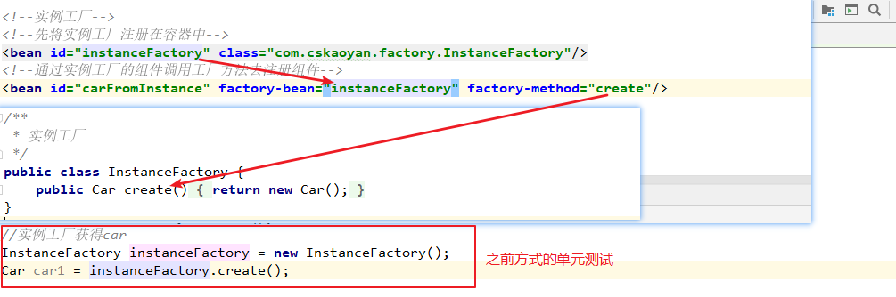
## Scope
* Singleton：每一次从容器中取出的组件都是**同一个**组件(默认是单例的形式)
* Prototype：每一次从容器中取出的组件都是**新的**组件(每一次都去new了一下)
## lifeCycle
重点部分：1、2、5、7、8、10

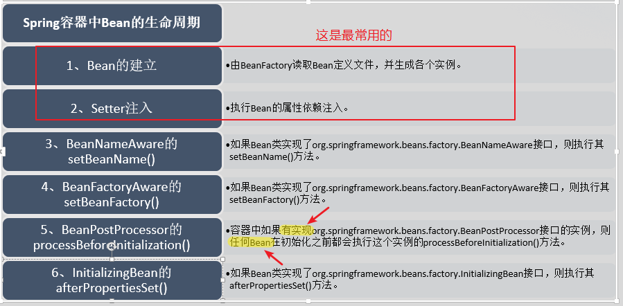

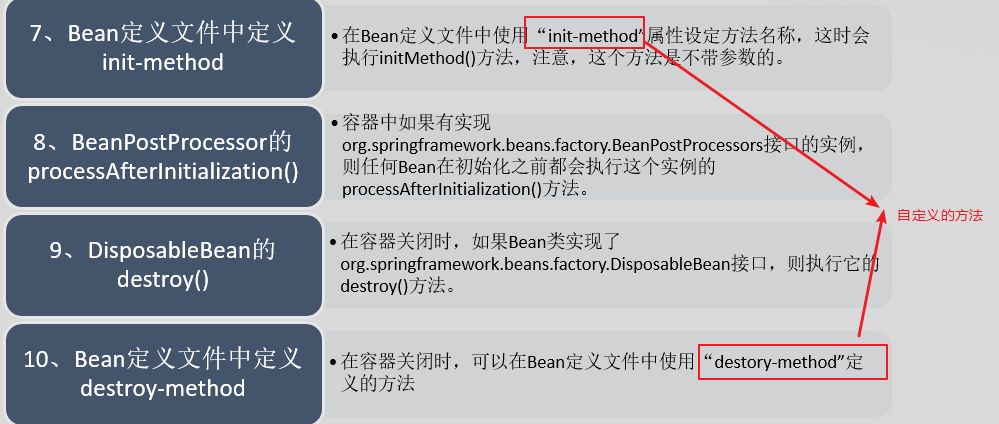

Demo：

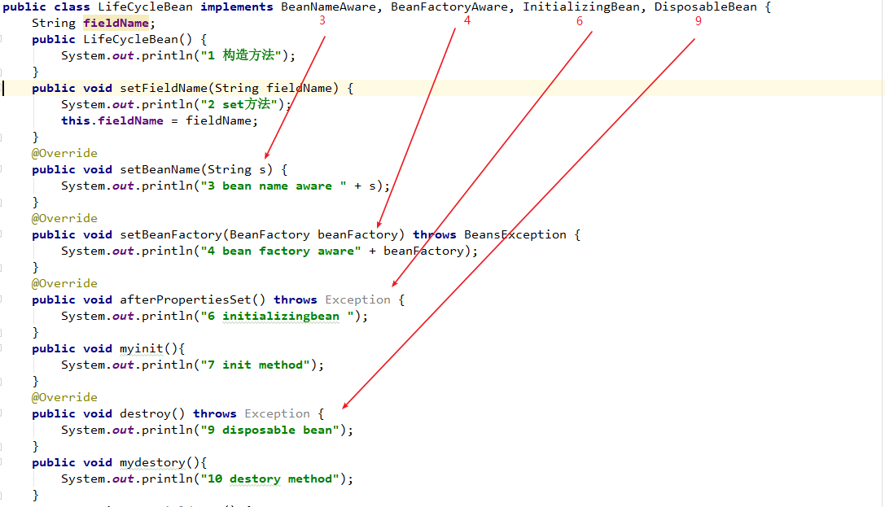

容器中的BeanPostProcessor

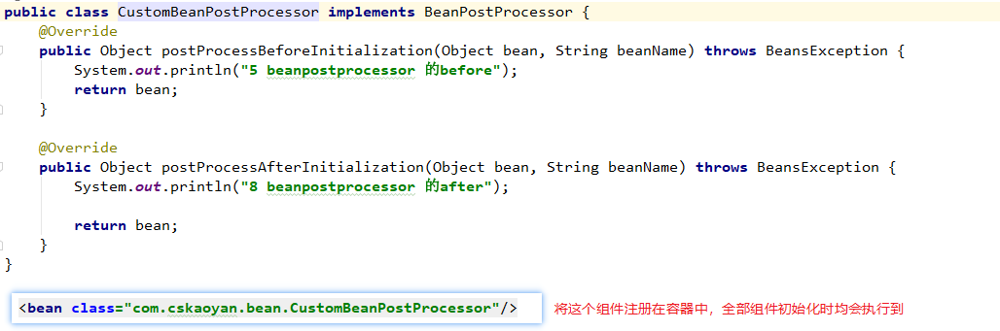

Init-method和destory-method的使用

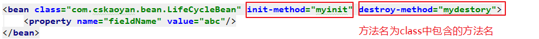
## CollectionData
**字符串**

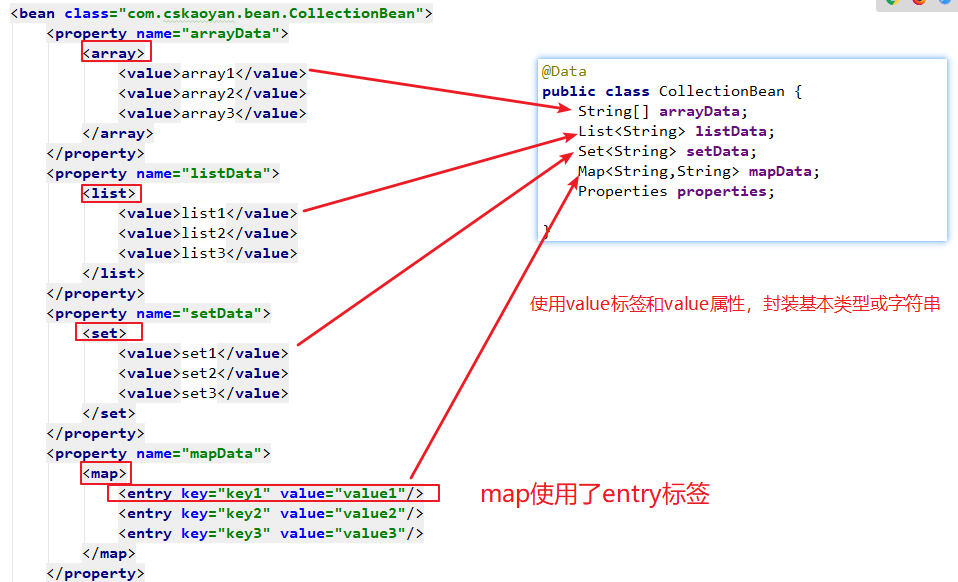

**Javabean类型**

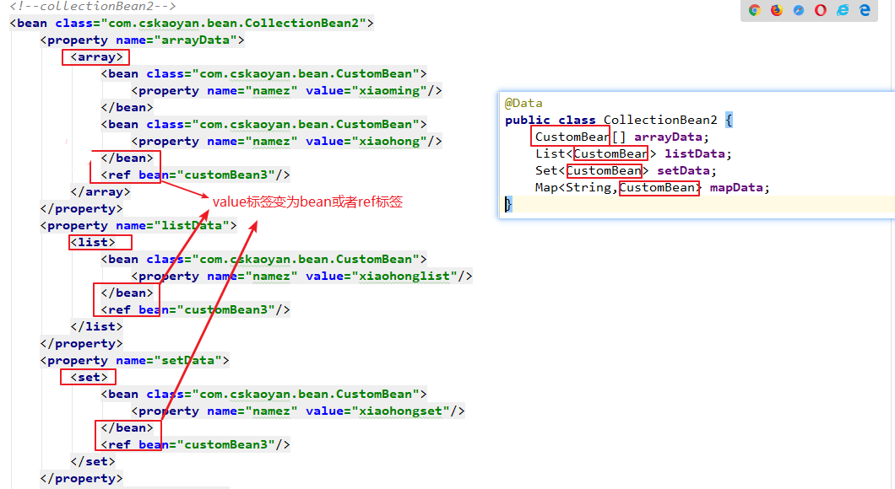

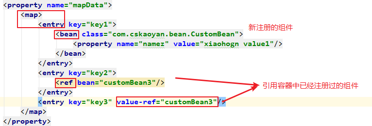
## 注解使用Spring
打开注解
```xml
<!-- com.cskaoyan这个包以及这个包下全部目录 -->
<context:component-scan base-package="com.cskaoyan"/>
```
### 组件注册类
#### Component
* @Component
* @Service
* @Repository
#### 注入类
* @Autowired
* @Qualifier 
* @Resource（name）
* @Value
#### @Scope
#### 生命周期
* @PostConstruct
* @PreDestroy
#### 单元测试
* @Runwith（SpringJUnit4ClassRunner.class）
* @ContextConfiguration(“classpath:application.xml”)
* @ContextConfiguration(classes={XXX.class})
