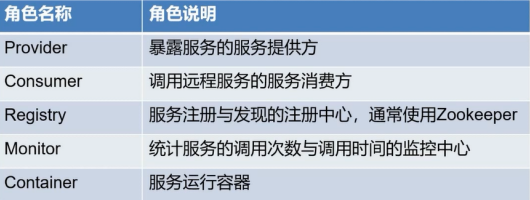

# Dubbo 引入

## SpringBoot 和 Dubbo 结合

#### 发布 dubbo 服务

* 添加依赖

  ```xml
  <dependency>
      <groupId>com.alibaba.spring.boot</groupId>
      <artifactId>dubbo-spring-boot-starter</artifactId>
      <version>2.0.0</version>
  </dependency>
  ```

* 在 application.properties 添加 dubbo 的相关配置信息

  ```properties 
  spring.application.name=dubbo-spring-boot-starter
  # true说明开启Dubbo服务
  spring.dubbo.server=true
  # 不使用注册中心
  spring.dubbo.registry=N/A
  ```

   注：这个配置只针对服务提供端，消费端不用指定协议，它自己会根据服务端的地址信息和@Reference注解去解析协议 

* 接下来在Spring Boot Application的上添加`@EnableDubboConfiguration`，表示要开启dubbo功能. (dubbo provider服务可以使用或者不使用web容器)

  ```java
  @SpringBootApplication
  @EnableDubboConfiguration
  public class DubboProviderLauncher {
    //...
  }
  ```

*  编写你的dubbo服务，只需要添加要发布的服务实现上添加`@Service`（import com.alibaba.dubbo.config.annotation.Service）注解，其中interfaceClass是要发布服务的接口. 

  ```java
  @Service(interfaceClass = IHelloService.class)
  @Component
  public class HelloServiceImpl implements IHelloService {
    //...
  }
  ```

*  启动你的Spring Boot应用，观察控制台，可以看到dubbo启动相关信息 

#### 如何消费 Dubbo 服务

* 添加依赖

  ```xml
  <dependency>
      <groupId>com.alibaba.spring.boot</groupId>
      <artifactId>dubbo-spring-boot-starter</artifactId>
      <version>2.0.0</version>
  </dependency>
  ```

*  在application.properties添加dubbo的相关配置信息 

  ```properties
  spring.application.name=dubbo-spring-boot-starter
  ```

*  开启`@EnableDubboConfiguration` 

*  通过`@Reference`注入需要使用的interface 

  ```java
  @Component
  public class HelloConsumer {
    @Reference(url = "dubbo://127.0.0.1:20880")
    private IHelloService iHelloService;
    
  }
  ```

## 服务注册和服务发现

#### 架构图




#### ZooKeeper

是一个中间件，负责为分布式系统提供协调服务。服务注册和服务发现

下载路径：https://www.apache.org/dyn/closer.cgi/zookeeper/

下载后修改 config 目录下的文件的文件名

`zoo_sample.cfg` 修改为 `zoo.cfg`

启动 `zkServer.cmd`


## SpringBoot 和 dubbo 项目 整合zookeeper

## 服务端

#### 导入依赖

```xml
<dependency>
    <groupId>com.101tec</groupId>
    <artifactId>zkclient</artifactId>
    <version>0.10</version>
</dependency>
```

#### 注解

```java
@SpringBootApplication
@EnableDubboConfiguration
public class Provider2Application {

    public static void main(String[] args) {
        SpringApplication.run(Provider2Application.class, args);
    }

}
```

```java
import com.alibaba.dubbo.config.annotation.Service;

@Service
@Component
public class DemoServiceImpl2 implements DemoService2 {
    @Override
    public String test() {
        System.out.println("DemoServiceImpl2");
        return "DemoServiceImpl2";
    }
}
```

#### 修改地址

```properties
spring.application.name=dubbo-spring-boot-starter
spring.dubbo.server=true
spring.dubbo.registry=zookeeper://localhost:2181
```

#### 启动

## 使用端

#### 依赖

```xml
<dependency>
   <groupId>com.101tec</groupId>
   <artifactId>zkclient</artifactId>
   <version>0.10</version>
</dependency>
```

#### 注解

```java
@SpringBootApplication
@EnableDubboConfiguration
public class Consumer2Application {

    public static void main(String[] args) {
        ConfigurableApplicationContext run = SpringApplication.run(Consumer2Application.class, args);
        TestService testService = (TestService) run.getBean("testService");
        System.out.println(testService.mytest());
    }

}
```

```java
import com.alibaba.dubbo.config.annotation.Reference;

@Component
public class TestService {

    //可以直接注入
    @Reference
    DemoService2 demoService2;

    public String mytest(){
        String say = demoService2.test();
        return say;
    }
}
```

#### 配置文件

```properties
spring.application.name=sb-consumer
spring.dubbo.registry=zookeeper://localhost:2181
```

# Dubbo 负载均衡

## 概念

LoadBalance 中文意思为负载均衡，它的职责是将网络请求，或者其他形式的负载“均摊”到不同的机器上。避免集群中部分服务器压力过大，而另一些服务器比较空闲的情况。通过负载均衡，可以让每台服务器获取到适合自己处理能力的负载。在为高负载服务器分流的同时，还可以避免资源浪费，一举两得

## 负载均衡策略


#### Random

随机加权

RandomLoadBalance 是加权随机算法的具体实现，它的算法思想很简单。假设我们有一组服务器 servers = [A, B, C]，他们对应的权重为 weights = [5, 3, 2]，权重总和为10。现在把这些权重值平铺在一维坐标值上，[0, 5) 区间属于服务器 A，[5, 8) 区间属于服务器 B，[8, 10) 区间属于服务器 C。接下来通过随机数生成器生成一个范围在 [0, 10) 之间的随机数，然后计算这个随机数会落到哪个区间上。权重越大的机器，在坐标轴上对应的区间范围就越大，因此随机数生成器生成的数字就会有更大的概率落到此区间内

#### RoundRobin

我们有三台服务器 A、B、C。我们将第一个请求分配给服务器 A，第二个请求分配给服务器 B，第三个请求分配给服务器 C，第四个请求再次分配给服务器 A。这个过程就叫做轮询。轮询是一种无状态负载均衡算法，实现简单，适用于每台服务器性能相近的场景下。

通常我们可以给轮询的机器设置不同的权重，经过加权后，每台服务器能够得到的请求数比例，接近或等于他们的权重比。比如服务器 A、B、C 权重比为 5:2:1。那么在8次请求中，服务器 A 将收到其中的5次请求，服务器 B 会收到其中的2次请求，服务器 C 则收到其中的1次请求

#### LeastActive

LeastActiveLoadBalance 翻译过来是最小活跃数负载均衡。活跃调用数越小，表明该服务提供者效率越高，单位时间内可处理更多的请求。此时应优先将请求分配给该服务提供者。在具体实现中，每个服务提供者对应一个活跃数 active。初始情况下，所有服务提供者活跃数均为0。每收到一个请求，活跃数加1，完成请求后则将活跃数减1。在服务运行一段时间后，性能好的服务提供者处理请求的速度更快，因此活跃数下降的也越快，此时这样的服务提供者能够优先获取到新的服务请求、这就是最小活跃数负载均衡算法的基本思想

#### ConsistentHash

* 一致性 Hash，相同参数的请求总是发到同一提供者
* 当某一台提供者挂时，原本发往该提供者的请求，基于虚拟节点，平摊到其他提供者，不会引起剧烈变动

## 配置

#### Random

默认配置

#### RoundRobin

##### 服务端配置

服务端服务级别：

```xml
<dubbo:service interface="..." loadbalance="roundrobin"/>
```

该服务的所有方法都是用 roundrobin 负载均衡

服务端方法级别：

```xml
<dubbo:service interface="...">
	<dubbo:method name="..." loadbalance="roundrobin"/>
</dubbo:service>
```

只有该服务的该方法使用 roundrobin 负载均衡

#### LeastActive

#### 补充说明

和 Dubbo 其他的配置类似，多个配置是有覆盖关系的：

1. 方法级有限，接口级次之，全局配置再次之
2. 如果级别一样，则消费方有限，提供方次之

所以，上面4中配置的优先级是：

1. 客户端方法级别配置
2. 客户端接口级别配置
3. 服务端方法级别配置
4. 服务端接口级别配置