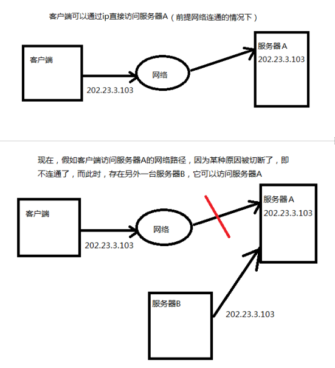
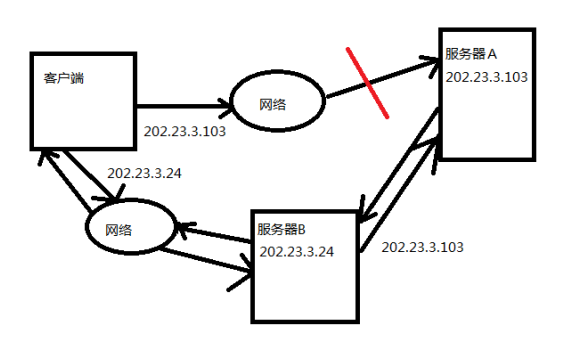
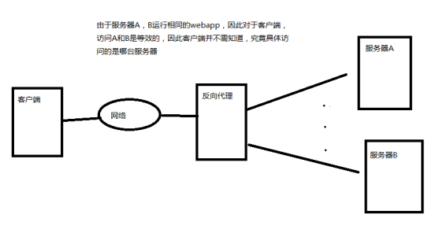
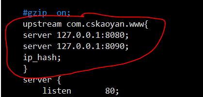
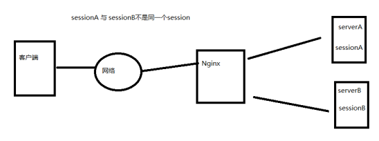

# Nginx 简介

Nginx (发音为[eng ine x])专为性能优化而开发，其最知名的优点是它的稳定性和低系统资源消耗，以及对并发连接的高处理能力(单台物理服务器可支持30000～50000个并发连接，tomcat通常是几百，不超过1000个)， 是一个高性能的 HTTP 和反向代理服务器，也是一个IMAP/POP3/SMTP 代理服务器

关于Nginx服务器，除了其高效性和稳定性的优点之外，我们最常使用的主要是其反向代理和负载均衡,以及动静分离功能

## 正向代理

通常，我们可以通过ip地址来直接访问网络中的某台确定的主机（更确切的说应该是通过socket套接字来访问确定中的某个确定的进程）



假设服务器B，能够将客户端的请求转发给服务器A，同时服务器B又能够将服务器A的响应转发给客户端，那么显而易见，我们就可以通过访问服务器B，从而达到访问服务器A的目的



现在，我们再来看客户端访问服务器A的过程，客户端通过服务器B同样达到了访问服务器A的目的，但是，请注意此时:服务器B似乎是作为客户端访问服务器A的一个“媒介”，而发挥作用这种情况下。

## 反向代理

与正向代理服务器不同，反向代理服务器的作用，不在仅仅是充当能够访问到目标服务器的“媒介”或者说，是作为客户端访问目标服务器的代理

反向代理是在服务器端（如Web服务器）作为代理使用，而不是客户端。客户端通过正向代理可以访问很多不同的资源，而反向代理是很多客户端都通过它访问不同后端服务器上的资源，而不需要知道这些后端服务器的存在，而以为所有资源都来自于这个反向代理服务器



## 负载均衡 load balancing

在上图中，我们可以看到，服务器A，B之间的功能完全相同，可以相互替代，通过将原本由一个服务器负责处理的任务，分担给多台服务器，从而减小了各个服务器的并发压力，同时扩展了服务器的带宽，从而提高了吞吐量——这就是负载均衡

集群和分布式的关系：

小饭店原来只有一个厨师，切菜，洗菜，备料，炒菜，全干。后来客人多了，厨房一个厨师忙不过来了，又请了一个厨师，两个厨师都能抄一样的菜，这两个厨师的关系就是集群。

为了让厨师专心炒菜，把菜做到极致，又请了个配菜师负责切菜，备料，备菜，厨师和配菜师的关系是分布式，后来发现，一个配菜师也忙不过来，又请了一个配菜师，这两个配菜师的关系就是集群

## 动静分离

对于一些基本很少发生变化的静态资源，可以直接放在Nginx服务器上，当客户端访问这些静态资源时，Nginx就可以直接返回给客户端，而不用在访问服务器集群，从而节省了部分请求和响应的时间。

这样一来，当客户端访问Nginx服务器时，当客户端访问静态资源时，Nginx就将静态资源直接返回给客户端，当客户端访问的是动态资源的时候，Nginx才会访问集群，这样一来，就实现了动态资源和静态资源的分离，从而提高了系统的吞吐量

# Nginx 安装和使用

## 安装 Nginx

* 首先，将下载好的Nginx的tar包，通过winscp传送到自己的家目录下，并解压

* 下载缺少的nginx的HTTP rewright模块所需要的库,PCRE library

  sudo apt-get install ilbpcre3 libpcre3-dev

* 下载所需的 zlib 库

  sudo apt-get install zlib1g-dev

* 配置Nginx

  ./configure

* 使用make，再使用make install

* 启动Nginx

  在/usr/local/nginx/sbin目录下

  ./nginx


## Nginx 配置反向代理

在配置反向代理。

可以实现通过nginx来访问tomcat

```conf
upstream com.wangdao.www{
	server 127.0.0.1:8080;
}
server{
	location / {
		root	html;
		index	index.html index.htm;
		add_header backendIP $upstream_addr;
		add_header backendStatus $upstream_status;
		proxy_pass http://com.wangdao.www;
	}
}
```

配置后需重启Nginx使配置文件生效

sudo /usr/local/nginx/sbin/nginx -s reload

没有做任何配置之前访问80端口是nginx的页面。

配置了反向代理之后，访问的是设置了端口号为8080的 tomcat 的页面

## Nginx 配置集群

首先确保，liunx上已经有开启两个tomcat服务器

* 两个tomcat的配置需要修改
* 在 tomcat 目录下的 conf 目录中的 server.xml 设置端口号
* 两个 tomcat 的端口号不能相同
* 更改完以后重启tomcat

配置nginx的代理集群

在 nginx 目录下的 conf 目录中

sudo vim nginx.conf



添加设置的另一个tomcat的端口号

然后重启Nginx使配置文件生效

sudo /usr/local/nginx/sbin/nginx -s reload

# Nginx 基本操作及配置

## Nginx 启动、重启、关闭操作

#### 启动 nginx：

在 nginx sbin 目录下   ./nginx

#### 重启 nginx：

* ./nginx -s reload  ：修改配置后重新加载生效 
* nginx -s reopen  ：重新打开日志文件  
* nginx -t -c /path/to/nginx.conf 测试nginx配置文件是否正确  

关闭nginx：

* ./nginx -s stop  :快速停止nginx 
*  quit  ：完整有序的停止ngin

其他停止 nginx 的方式：

ps -ef | grep nginx  

 

* kill -QUIT 主进程号   ：从容停止Nginx  
* kill -TERM 主进程号   ：快速停止Nginx  
* pkill -9 nginx      ：强制停止Nginx 

## 负载均衡策略 Nginx 负载均衡选项 upstream 用法举例

#### 轮询(weight=1)

默认选项，当weight不指定时，各服务器weight相同

每个请求按时间顺序逐一分配到不同的后端服务器，如果后端服务器down掉，能自动剔除

#### weight

指定轮询几率，weight和访问比率成正比，用于后端服务器性能不均的情况

如果后端服务器down掉，能自动剔除

比如以下配置，则1.11服务器的访问量为1.10服务器的两倍

#### ip_hash

每个请求按访问ip的hash结果分配，这样每个访客固定访问一个后端服务器，**可以解决session不能跨服务器的问题**

如果后端服务器down掉，要手工down掉

#### fair（第三方插件）

按后端服务器的响应时间来分配请求，响应时间短的优先分配

#### url_hash（第三方插件）

按访问url的hash结果来分配请求，使每个url定向到同一个后端服务器，后端服务器为缓存服务器时比较有效

在upstream中加入hash语句，hash_method是使用的hash算法

设备的状态有:

* down 表示单前的server暂时不参与负载
* weight 权重,默认为1。 weight越大，负载的权重就越大。
* max_fails 允许请求失败的次数默认为1。当超过最大次数时，返回proxy_next_upstream 模块定义的错误
* fail_timeout max_fails次失败后，暂停的时间。
* backup 备用服务器, 其它所有的非backup机器down或者忙的时候，请求backup机器。所以这台机器压力会最轻

## Session 共享问题

使用了Nginx和集群，对客户端的请求做了负载均衡，从系统的吞吐量的角度来看，这无疑是很好的，但是，随之而来的一个问题，就是session共享的问题



如图，在浏览器的一次会话中，两次访问Nginx代理的集群，Nginx分别把这两次请求，分配给了不同的服务器来处理，于是出现了这样一个问题：

* 首先，session只产生和存在于单个服务器中
* 明明是逻辑上的一次会话，因为实际访问了两台不同的服务器，所以两台服务器会分别为针对它们各自的请求而新建会话（假设两台服务器都是被该浏览器第一次访问）
* 于是，一次会话的信息，实际上被两个服务器中的两个session所存储，每个session实际只存储，这次会话的部分信息
* 这种情况下，我们通过nginx访问同一个页面多次，可能会访问不同服务器上的同一个页面，session不同步的问题会导致用户必须在同一个页面登录两次

## Session 共享问题的解决

#### Session sticky

这种解决方案的思路，比较简单，就是用一个hash算法，将对某ip的访问映射到一台确定的服务器上，这样针对某ip的访问就固定到一台确定的服务器，不同的ip访问不同的服务器。

同时，这种解决方案也有一定的局限性：

* 一旦tomcat所在的某台服务器重新启动，那么与这台服务器相关的会话信息就会丢失，如果用户此时再次访问相同网页，需要重新登录。高可用不满足
* 代理服务器需要计算，保存，维护ip和相应服务器之间的映射关系，内存消耗大

#### Seesion Replication 高可用

这种解决方案的思路是，每个服务器上，都有集群中其他服务器中session数据的副本，同时增加服务器之间的数据同步功能，通过服务器之间的同步保证session数据在各个服务器之间的一致性

这种解决方案，不再像session sticky中那样要求Nginx服务器做一些处理，但是这种方式的局限性也很大：

* 一旦session数据发生变化，所有的服务器都需要同步变化的session数据，而这种同步会消耗带宽。
* 同时，由于每台服务器都存储了其他所有服务器上的session副本， 冗余数据也占用了服务器的存储空间

两个关键配置：

两个Tomcat的server.xml

解开注释


两个应用的web.xml

添加标签


#### Session 数据集中控制

这种解决方案的思路是，将所有服务器上的session数据集中存储和管理，这样一来，所有的服务器的session在集群中只需要有一份。

这种解决方案，由于session并不存储在本地，对session的访问需要通过网络，这样可能就会产生访问的延时，以及不稳定性，不过我们通信基本都是发生在内网，问题不大，如果集中存储Session的机器或者集群有问题，就会影响我们的应用。

Redis  内存数据库  Nosql 

s