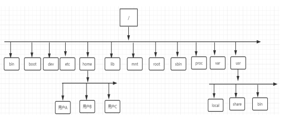

# Linux操作系统的组成

- 操作系统 = 内核 + 系统程序

- 系统程序 = 编译环境 + API + AUI

- 编译环境 = 编译程序 + 连接程序 + 装载程序

- API = 系统调用 + 语言库函数(C,C++etc)

- AUI = shell + 系统服务程序 + 应用程序(浏览器，字处理，编辑器)

  

## Linux文件系统目录

- `/:`根目录，所有的目录、文件、设备都在/之下，/就是Linux文件系统的组织者，也是最上级的领导者。 
- `/bin`:bin 就是二进制（binary）英文缩写。在一般的系统当中，都可以在这个目录下找到linux常用的命令。系统所需要的那些命令位于此目录。
- `/boot`:Linux的内核及引导系统程序所需要的文件目录。
- `/dev:dev 是设备（device)的英文缩写。这个目录对所有的用户都十分重要。因为在这个目录中包含了所有linux系统中使用的外部设备。但是这里并不是放的外部设备的驱动程序。这一点和常用的windows,dos操作系统不一样。它实际上是一个访问这些外部设备的端口。可以非常方便地去访问这些外部设备，和访问一个文件，一个目录没有任何区别。`
- `/home`:如果建立一个用户，用户名是"xx",那么在/home目录下就有一个对应的/home/xx路径，用来存放用户的主目录。家目录
- `/lib:lib是库（library）英文缩写。这个目录是用来存放系统动态连接共享库的。几乎所有的应用程序都会用到这个目录下的共享库。因此，千万不要轻易对这个目录进行什么操作，一旦发生问题，系统就不能工作了。`
- `/proc`:存储的是当前内核运行状态的一系列特殊文件，用户可以通过这些文件查看有关系统硬件及当前正在运行进程的信息，甚至可以通过更改其中某些文件来改变内核的运行状态
- `/root`:Linux超级权限用户root的家目录。
- `/sbin`:这个目录是用来存放系统管理员的系统管理程序。大多是涉及系统管理的命令的存放，是超级权限用户root的可执行命令存放地，普通用户无权限执行这个目录下的命令，sbin中包含的都是root权限才能执行的。
- `/usr`:这是linux系统中占用硬盘空间最大的目录。**用户的很多应用程序和文件都存放在这个目录下**。 Unix software resource usr 
- `/usr/local`:这里主要存放那些手动安装的软件，即不是通过或apt-get安装的软件。它和/usr目录具有相类似的目录结构。
- `/usr/share` :系统共用的东西存放地，比如 /usr/share/fonts 是字体目录，/usr/share/doc和/usr/share/man帮助文件。

# Linux Shell

shell 是系统的用户界面

通俗来讲，提供了用户使用操作系统的接口，是一种命令语言，更是我们使用linux的桥梁，通过shell脚本我们还可以使用大部分系统内核的功能

