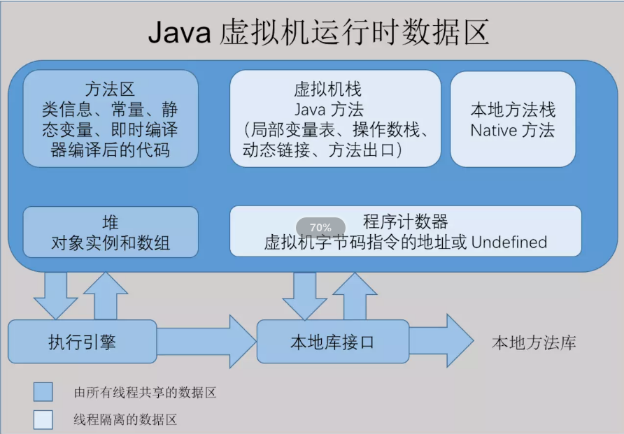
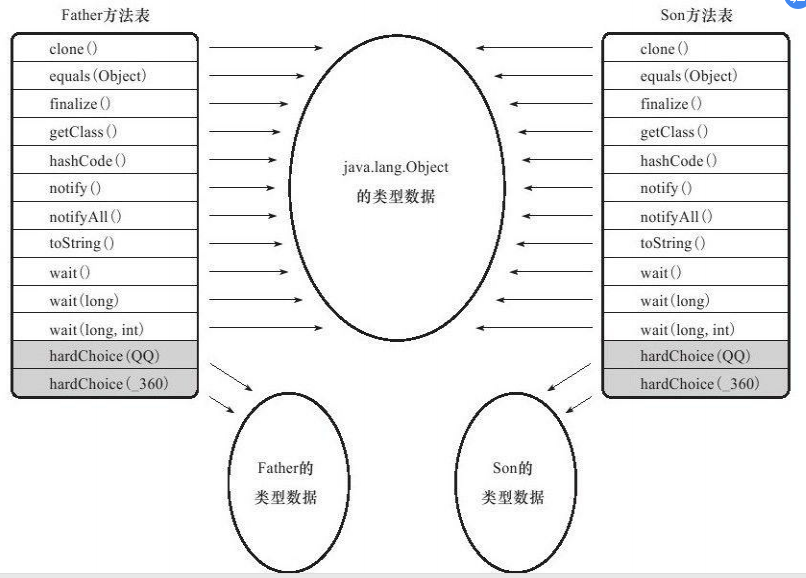
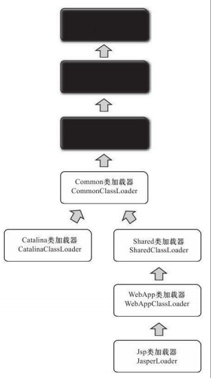
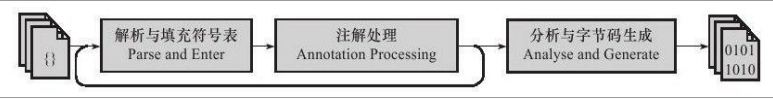
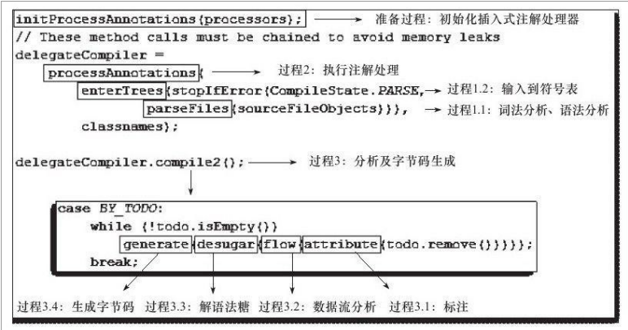

## 深入理解java虚拟机

#  JDK
## 我们可以把Java程序设计语言、Java虚拟机、Java API类库这三部分统称为JDK
可以把Java API类库中的Java SE API子集和Java虚拟机这两部分统称为JRE
    
# java内存区域与内存溢出异常
## 运行时数据区域



### 程序计数器(线程私有)
程序计数器可以看作是当前线程所执行的字节码的行号指示器。字节码解释器工作时就是通过改变这个计数器的值来选取下一条需要执行的字节码指令，分支、循环、跳转、异常处理、线程恢复等基础功能都需要依赖这个计数器来完成

* 线程私有的内存     
<font color="red">java多线程中，为了线程切换后能恢复到正确的执行位置，每条线程都需要有一个独立的程序计数器，各条线程之间计数器互不影响，独立存储，我们称这类内存区域为“线程私有”的内存</font>
* 执行Native方法时，计数器的值   
如果线程正在执行的是一个java方法，这个计数器记录的是正在执行的虚拟机字节码指令的地址；如果正在执行的是Native方法，这个计数器值则为空。此内存区域是唯一一个在Java虚拟机规范中没有规定任何OutOfMemoryError情况的区域
### java虚拟机栈(线程私有)
生命周期与线程相同

* 方法执行时   
虚拟机栈描述的是Java方法执行的内存模型：每个方法在执行的同时都会创建一个栈帧(Stack Frame)用于存储局部变量表、操作数栈、动态链接、方法出口等信息。每一个方法从调用直至执行完成的过程，就对应着一个栈帧在虚拟机栈中入栈到出栈的过程
* 局部变量表   
局部变量表存放了编译期可知的各种基本数据类型（boolean、byte、char、short、int、 float、long、double）、对象引用和 returnAddress类型（指向了一条字节码指令的地址）
* 两种异常状况(重要)   
如果线程请求的栈深度大于虚拟机所允许的深度，将抛出StackOverflowError异常；如果虚拟机栈可以动态扩展，如果扩展时无法申请到足够的内存，就会抛出OutOfMemoryError异常
### 本地方法栈
本地方法栈与虚拟机栈所发挥的作用是非常相似的，它们之间的区别不过是虚拟机栈为虚拟机执行Java方法服务，而本地方法栈则为虚拟机使用到的Native方法服务
与虚拟机栈一样，本地方法栈区域也会抛出StackOverflowError和OutOfMemoryError异常

* 异常   
本地方法栈区域也会抛出StackOverflowError和OutOfMemoryError异常
### java堆(各线程共享)
java堆是被所有线程共享的一块内存区域，在虚拟机启动时创建
java堆区域的唯一目的就是存放对象实例

* "GC堆"   
java堆也被称为 "GC堆" ，因为是垃圾收集器管理的主要区域
* 分代收集算法   
新生代和老年代，堆中数据进一步划分的目的是为了更好地回收内存，或者更快地分配内存
* java堆的内存空间   
根据Java虚拟机规范的规定，Java堆可以处于物理上不连续的内存空间中，只要逻辑上是连续的即可，就像我们的磁盘空间一样。在实现时，既可以实现成固定大小的，也可以是可扩展的
* 异常   
如果在堆中没有内存完成实例分配，并且堆也无法再扩展时，将会抛出OutOfMemoryError异常
### 方法区(各线程共享)
方法区用于存储已被虚拟机加载的类信息、常量、静态变量、即时编译器编译后的代码等数据

* 异常   
根据Java虚拟机规范的规定，当方法区无法满足内存分配需求时，将抛出 OutOfMemoryError异常
### 运行时常量池(方法区一部分)
常量池用于存放编译期生产的各种字面量和符号引用，这部分内容将在类加载后进入方法区的运行时常量池中存放

* 运行时常量池   
运行时常量池相对于Class文件常量池的另外一个重要特征是具备动态性，Java语言并不要求常量一定只有编译期才能产生，也就是并非预置入Class文件中常量池的内容才能进入方法区运行时常量池，运行期间也可能将新的常量放入池中，这种特性被开发人员利用得比较多的便是String类的intern()方法
* 异常   
当常量池无法再申请到内存时会抛出OutOfMemoryError异常
### 直接内存
* NIO类   
NIO类，引入了一种基于通道与缓冲区的I/O方式，它可以使用Native函数库直接分配堆外内存，然后通过一个存储在Java堆中的DirectByteBuffer对象作为这块内存的引用进行操作。这样能在一些场景中显著提高性能，因为避免了在Java堆和Native堆中来回复制数据

* 异常   
服务器管理员有时会忽略直接内存，使得各个内存区域总和大于物理内存限制，从而导致动态扩展时出现OutOfMemoryError异常
## 对象
### 对象的创建
类加载 --> 分配内存 --> 

* 分配内存
   * 堆中的内存是规整的  
*指针碰撞*  
假设java堆中的内存是规整的，所有用过的内存都放在一边，空闲的内存放在另一边，中间放着一个指针作为分界点的指示器，那所分配内存就仅仅是把那个指针向空闲空间那边挪动一段与对象大小相等的距离，这种分配方式称 为“指针碰撞”

   * 堆中的内存不是规整的  
*空闲列表*   
如果Java堆中的内存并不是规整的，已使用的内存和空闲的内存相互交错，那就没有办法简单地进行指针碰撞了，虚拟机就必须维护一个列表，记录上哪些内存块是可用的，在分配的时候从列表中找到一块足够大的空间划分给对象实例，并更新列表上的记录，这种分配方式称为“空闲列表”

   * 分配方式的选择   
选择哪种分配方式由Java堆是否规整决定，而Java堆是否规整又由所采用的垃圾收集器是否带有压缩整理功能决定。因此，在使用Serial、ParNew等带Compact过程的收集器时，系统采用的分配算法是指针碰撞，而使用CMS这种基于Mark-Sweep算法的收集器时，通常采用空闲列表
   * 分配内存时的线程安全问题(解决方案)   
       1. 对分配内存空间的动作进行同步处理
       2. 把内存分配的动作按照线程划分在不同的空间之中进行，即每个线程在Java堆中预先分配一小块内存，称为本地线程分配缓冲。哪个线程要分配内存，就在哪个线程的TLAB上分配，只有TLAB用完并分配新的TLAB时，才需要同步锁定
* 内存空间初始化
   * 对象头   
内存空间分配完成后会初始化为0，接下来就是填充对象头
### 对象的内存布局
对象在内存中存储的布局可以分为3块区域：对象头、实例数据和对齐填充
* 对象头   
包括两部分信息
   1. 用于存储对象自身的运行时数据   
如哈希码、GC分代年龄、锁状态标志、线程持有的锁、偏向线程ID、偏向时间戳等
   2. 类型指针(对象指向它的类元数据的指针，虚拟机通过这个指针来确定这个对象是哪个类的实例)   
*对象为一个数组时*   
对象头中必须有一块用于记录数组长度的数据，因为虚拟机可以通过普通Java对象的元数据信息确定Java对象的大小，但是从数据的元数据中却无法确定数组的大小
* 实例数据   
程序代码中所定义的各种类型的字段内容(包含父类继承下来的和子类中定义的)
* 对齐填充   
不是必然需要，主要是占位，保证对象大小是某个字节的整数倍        
### 对象的访问定位
Sun HotSpot使用的是直接指针访问
* 句柄访问
   * reference中存储对象的句柄地址   
句柄中包含了对象实例数据与类型数据各自的具体地址信息
* 直接指针访问
   * reference中存储的直接就是对象地址
* 两种对象访问方式各自的优点
   * 句柄访问   
reference中存储的是稳定的句柄地址，在对象被移动时(GC)只会改变句柄中的实例数据指针，而reference本身不需要修改
   * 直接指针访问  
速度更快，它节省了一次指针定位的时间开销，由于对象的访问在Java中非常频繁，因此节省的时间也比较可观

### Java 堆溢出

* 堆溢出 

  java 堆用于存储对象实例，我们只要不断地创建对象，并且保证 GC Roots 到对象之间有可达路径来避免垃圾回收机制清除这些对象，那么随着对象数量的增加，总容量触及最大堆的容量限制后就会产生内存溢出异常

  Java 堆内存的 OutOfMemoryError 异常是实际应用中最常见的内存溢出异常情况。出现 Java 堆内存溢出时，异常堆栈信息 "java.lang.OutOfMemoryError" 会跟随进一步提示 "Java heap space"

* 检查

  * 第一步首先应确认内存中导致 OOM 的对象是否是必要的，也就是要先分清楚到底是出现了内存泄漏(Memory Leak)还是内存溢出(Memory Overflow)

  * 如果是内存泄露

    可进一步通过工具查看泄漏对象到 GC Roots 的引用链，找到泄漏对象是通过怎样的引用路径、与哪些 GC Roots 相关联，才导致垃圾收集器无法回收它们，根据泄漏对象的类型信息以及它到 GC Roots 引用链到信息，一般可以比较准确地定位到这些对象创建的位置，进而找出产生内存泄漏的代码的具体位置

  * 如果不是内存泄漏，换句话说就是内存中的对象却是都是必须存活的，那就应当检查 Java 虚拟机的堆参数（-Xmx与-Xms）设置，与机器的内存对比，看看是否还有向上调整的空间。再从代码上检查是否存在某些对象生命周期过长、持有状态时间过长、存储结构设计不合理等情况，尽量减少程序运行期的内存消耗

# 垃圾收集器与内存分配策略 
## 概述
### GC已自动化，为什么要去了解
当需要排查各种内存溢出、内存泄漏问题时，当垃圾收集成为系统达到更高并发量的瓶颈时，我们就需要对这些“自动化”的技术实施必要的监控和调节               
### 运行时区域
程序计数器、虚拟机栈、本地方法栈 3 个区域随线程生灭(因为是线程私有)，栈中的栈帧随着方法的进入和退出而有条不紊地执行着出栈和入栈操作。而 Java 堆和方法区则不一样，一个接口中的多个实现类需要的内存可能不一样，一个方法中的多个分支需要的内存也可能不一样，我们只有在程序处于运行期才知道那些对象会创建，这部分内存的分配和回收都是动态的，垃圾回收器所关注的就是这部分内存

## 判断对象是否死亡(重点)
垃圾收集器在对堆进行回收前，第一件事情就是要确定这些对象之中哪些还“存活”着，哪些已经“死去”（即不可能再被任何途径使用的对象）
### 引用技术算法
* 算法思想   
给对象中添加一个引用计数器，每当有一个地方引用它时，计数器值就加1；当引用失效时，计数器值就减1；任何时刻计数器为0的对象就是不可能再被使用的
* 好处   
实现简单，判定效率也很高
* 缺点   
   1. 很难解决对象之间的相互循环引用的问题   
   2. 当两个对象互相指向对方，而且这两个对象再无任何其他引用时，实际上这两个对象已经不可能在被访问，但因为互相引用，导致他们的引用计数都不为0，所以引用计数算法无法通知GC收集器回收它们
### 可达性分析算法
算法思想   
通过一系列称为 "GC Roots" 的对象作为起始点，从这些节点开始向下搜索，搜索所走过的路径称为引用链，当一个对象到GC Roots没有任何引用链相连(就是说从GC Roots到这个对象不可达)时，则证明此对象时是不可用的
* 可作为GC Roots的对象   
   * 虚拟机栈(栈帧中的本地变量表)中引用的对象
   * 方法区中类静态属性引用的对象
   * 方法区中常量引用的对象
   * 本地方法栈中JNI(即一般说的Native方法)引用的对象
   * Java 虚拟机内部的引用，如基本数据类型对应的 Class 对象，一些常驻的异常对象等，还有系统类加载器
   * 所有被同步锁（synchronized关键字）持有的对象
   * 反映 Java 虚拟机内部情况的 JMXBean、JVMTI中注册的回调、本地代码缓存等

### 再谈引用  

我们希望能描述这样一类对象：当内存空间还足够时，则能保留在内存之中；如果内存空间在进行垃圾收集后还是非常紧张，则可以抛弃这些对象   
引用被分为下面几类：

 * 强引用   
    * 指在程序代码中普遍存在的   
    * 类似 "Object obj = new Object()" 这类引用，只要强引用还存在，垃圾收集器永远不会回收掉被引用的对象
 * 软引用   
    * 用来描述一些还有用但并非必需的对象   
    * 对于软引用关联着的对象，在系统将要发生内存溢出异常之前，将会把这些对象列进回收范围之中进行第二次回收。如果这次回收还没有足够的内存，才会抛出内存溢出异常
 * 弱引用   
    * 也是用来描述非必需对象，但比软引用更弱一些   
    * 被弱引用关联的对象只能生存到下一次垃圾收集发生之前，当垃圾收集器工作时，无论当前内存是否足够，都会回收掉只被弱引用关联的对象
 * 虚引用   
    * 也被称为幽灵引用或者幻影引用，它是最弱的一种引用关系   
    * 一个对象是否有虚引用的存在，完全不会对其生存时间构成影响，也无法通过虚引用来取得一个对象实例   
    * 为一个对象设置虚引用关联的唯一目的就是能在这个对象被收集器回收时收到一个系统通知

生存还是死亡   
* 即使在可达性分析算法中不可达的对象，也并非是“非死不可”的，这时候它们暂时处于“缓刑”阶段，要真正宣告一个对象死亡，至少要经历两次标记过程   
* 如果对象在进行可达性分析后发现没有与GC Roots相连接的引用链，那它将会被第一次标记并且进行一次筛选，筛选的条件是此对象是否有必要执行finalize()方法。当对象没有覆盖finalize()方法，或者finalize()方法已经被虚拟机调用过，虚拟机将这两种情况都视为“没有必要执行”   
* 如果这个对象被判定为有必要执行 finalize() 方法，那么这个对象将会放置在一个叫做 F-Queue 的队列中，并在稍后由一个由虚拟机自动建立的、低优先级的 Finalizer 线程去执行它。这里所谓的“执行”是指虚拟机会触发这个方法，并不承诺或等待他运行结束。finalize() 方法是对象逃脱死亡命运的最后一次机会，稍后 GC 将对 F-Queue 中的对象进行第二次小规模的标记，如果对象要在 finalize() 中成功拯救自己 —— 只要重新与引用链上的任何一个对象建立关联即可   
* finalize() 方法只会被系统自动调用一次

回收方法区
在堆中，尤其是在新生代中，一次垃圾回收一般可以回收 70% ~ 95% 的空间，而永久代的垃圾收集效率远低于此
 * 永久代垃圾回收   
永久代垃圾回收主要两部分内容：废弃的常量和无用的类   
    * 判断废弃常量：一般是判断没有该常量的引用
    * 判断无用的类：要以下三个条件都满足
       1. 该类所有的实例都已经回收，也就是 Java 堆中不存在该类的任何实例
       2. 加载该类的 ClassLoader 已经被回收
       3. 该类对应的 java.lang.Class 对象没有任何地方被引用，无法在任何地方通过反射访问该类的方法

### 垃圾收集算法

* 标记-清除算法 

  分为两个阶段：   
  
   1. 标记：标记出所有需要回收的对象
   2. 清除：标记完成后统一回收所有被标记的对象
   * 不足   
      1. 效率问题：标记和清除效率都不高
      2. 空间问题：标记清除之后会产生大量不连续的内存碎片
  
* 复制算法

  这种收集算法解决了标记清除算法存在的效率问题。它将内存区域划分成相同的两个**内存块**。每次仅使用一半的空间，`JVM`生成的新对象放在一半空间中。当一半空间用完时进行`GC`，把可到达对象复制到另一半空间，然后把使用过的内存空间一次清理掉。

  * **优点**：

    按顺序分配内存即可，实现简单、运行高效，不用考虑内存碎片。

  * **缺点**：

    可用的内存大小缩小为原来的一半，对象存活率高时会频繁进行复制。

#### 并发的可达性分析

* 目前主流的编程语言的垃圾收集器基本上都是依靠可达性分析算法来判断对象是否存活，必须全程冻结用户线程的运行，然后进行标记操作，下面来对整个标记过程进行推导（引入三色标记作为工具来辅助推导）：

  * 白色

    表示对象尚未被垃圾收集器访问过。显然在可达性分析刚开始的阶段，所有对象都是白色的，若在分析结束的阶段，仍然是白色的对象，即代表不可达

  * 黑色

    表示对象已经被垃圾收集器访问过，且这个对象的所有引用都已经扫描过。黑色的对象代表已经扫描过，它是安全存活的，如果有其他对象引用指向了黑色对象，无需重新扫描一边。黑色对象不可能直接（不经过灰色对象）指向某个白色对象

  * 灰色

    表示对象已经被垃圾收集器访问过，但这个对象上至少存在一个引用还没有被扫描过

* 由此可见，扫描过程中必须保持线程的冻结，不然出现收集器在对象上标记颜色，同时用户线程在修改引用关系——即修改对象图的结构，这样可能出现两种后果

  * 一种是吧原本消亡的对象错误标记为存活，这不是好事，但可以容忍，只不过产生了一点逃过本次手机的浮动垃圾而已，下次收集清理掉就好
  * 另一种是把原本存活的对象错误标记为已消亡，这就是非常致命的后果了，程序肯定会因此发生错误

* 由此，证明了一个理论，当且近当以下两个条件同时满足时，会产生“对象消失”的问题，即原本应该是黑色的对象被误标为白色：

  * 赋值器插入一条或者多条从黑色对象到白色对象到新引用
  * 赋值器删除了全部从灰色对象到该白色对象到直接或间接引用

  因此，我们要解决并发扫描时的对象消失问题，只需破坏这两个条件的任意一个即可，由此分别产生了两种解决方案：增量更新和原始快照

  * 增量更新要破坏的是第一个条件，当黑色对象插入新的指向白色对象的引用关系时，就将这个新插入的引用记录下来，等并发扫描结束之后，再将这些记录过的引用关系中的黑色对象为根，重新扫描一次。这可以简化理解为，黑色对象一旦新插入了指向白色对象的引用之后，它就变回灰色对象了
  * 原始快照要破坏的是第二个条件，当灰色对象要删除指向白色对象的引用关系时，就将这个要删除的引用记录下来，在并发扫描结束之后，再将这些记录过的引用关系中的灰色对象为根，重新扫描一次。这也可以简化理解为，无论引用关系删除与否，都会按照刚刚开始扫描那一刻的对象图快照来进行搜索

# 虚拟机类加载机制
## 类加载的时机
### 类的生命周期
1. 加载
2. 验证
3. 准备
4. 解析
5. 初始化
6. 使用
7. 卸载
### 需立即对类进行"初始化"的5种情况
1. 遇到到new、getstatic、putstatic或invokestatic这4条字节码指令时，如果类没有进行过初始化，则需要先触发其初始化。
2. 使用java.lang.reflect包的方法对类进行反射调用的时候，如果类没有进行过初始化，则需要先触发其初始化
3. 当初始化一个类的时候，如果发现其父亲还没有进行过初始化，则需要先触发其父类的初始化
4. 当虚拟机启动时，用户需要指定一个要执行的主类(包含main()方法的那个类)，虚拟机会先初始化这个主类
5. 当使用JDK1.7的动态语言支持时，如果一个java.lang.invoke.MethodHandle实例最后的解析结果果REF_getStatic、REF_putStatic、REF_invokeStatic的方法句柄，并且这个方法句柄所对应的类没有进行过初始化，则需要先触发其初始化
这5种情况的行为数据对一个类进行主动引用
* 对于静态字段，只有直接定义这个字段的类才会被初始化，因此通过其子类来引用父类中定义的静态字段，只会触发父类的初始化而不会触发子类的初始化
* 被动引用例子   
当调用SubClass.value时只会输出"SuperClass init!"   
对于静态字段，只有直接定义这个字段的类才会被初始化，因此通过其子类来引用父类中定义的静态字段，只会触发父类的初始化而不会触发子类的初始化
```java
public class SuperClass {
    static {
        System.out.println("SuperClass init!");
    }
    public static int value = 1127;
}
public class SubClass extends SuperClass {
    static {
        System.out.println("SubClass init!");
    }
}
//当调用ConstClass.HELLOWORLD时并没有输出"ConstClass init!"
//因为虽然引用了ConstClass类中的常量HELLOWORLD，但其实在编译阶段通过常量传播优化，已经将此常量的值存到了main方法所在类的常量池中，以后main方法所在类对常量ConstClass.HELLOWORLD的引用实际都被转化为main方法所在类对自身常量池的引用了
public class ConstClass {
    static {
        System.out.println("ConstClass init!");
    }
    public static final String HELLOWORLD = "hello world!"
}

public class NotInitialization {
    public static void main(String[] args) {
        System.out.println(SubClass.value);
        /**
        *  output : SuperClass init!
        * 
        * 通过子类引用父类的静态对象不会导致子类的初始化
        * 只有直接定义这个字段的类才会被初始化
        */

        SuperClass[] sca = new SuperClass[10];
        /**
        *  output : 
        * 
        * 通过数组定义来引用类不会触发此类的初始化
        * 虚拟机在运行时动态创建了一个数组类
        */

        System.out.println(ConstClass.HELLOWORLD);
        /**
        *  output : 
        * 
        * 由于final关键词修饰，在准备阶段就会把值赋到变量中
        * 常量在编译阶段会存入调用类的常量池当中，本质上并没有直接引用到定义类常量的类，
        * 因此不会触发定义常量的类的初始化。
        * “hello world” 在编译期常量传播优化时已经存储到 NotInitialization 常量池中了。
        */
    }
}
```
## 类加载的过程
### 加载
虚拟机需要完成下面三件事
1. 通过一个类的全限定名来获取定义此类的二进制字节流
2. 将这个字节流所代表的静态存储结构转化为方法区的运行时数据结构
3. 在内存中生成一个代表这个类的java.lang.Class对象，作为方法区这个类的各种数据的访问入口
### 验证
验证是连接阶段的第一步，这一阶段的目的是为了确保Class文件的字节流中包含的信息符合当前虚拟机的要求，并且不会危害虚拟机自身的安全
* 文件格式验证   
验证字节流是否符合Class文件格式的规范，并且能被当前版本的虚拟机处理
* 元数据验证   
对字节码描述的信息进行语义分析，以保证其描述的信息符合Java语言规范的要求
* 字节码验证   
通过数据流和控制流分析，确定程序语义是合法的、符合逻辑的
* 符号引用验证   
对类自身以外(常量池中的各种符号引用)的信息进行匹配性校验
### 准备
准备阶段是正式为类变量(被static修饰的变量)分配内存并设置类变量初始值的阶段，这些变量所使用的内存都将在方法区中进行分配
### 解析
解析阶段是虚拟机将常量池内的符号引用替换为直接引用的过程
### 初始化
在准备阶段，变量已经赋过一次系统要求的初始值，而在初始化阶段，则根据程序员通过程序制定的主观计划去初始化类变量和其他资源
## 类加载器        
当写完一个.java文件的时候，编译器会把它编译成一个由字节码组成的class文件，当程序运行时，JVM会首先寻找包含有main()方法的类，把这个class文件中的字节码数据读入进来，转化为JVM中运行是对应的Class对象。执行这个动作的，就叫类加载器
### 启动类加载器
这个类加载器负责将一些核心的，被JVM识别的类加载进来，用C++实现，与JVM是一体的
* 扩展类加载器   
这个类加载器用来加载Java的扩展库
* 应用程序类加载器   
用于加载我们自己定义编写的类
* 用户自己实现的加载器   
当实际需要自己掌控类加载过程时才会用到，一般没有用到
### 双亲委派模型
* 层次关系   
双亲委派模型要求除了顶层的启动类加载器外，其余的类加载器都应当有自己的父类加载器
* 工作过程   
如果一个类加载器收到了类加载的请求，它首先不会自己去尝试加载这个类，而是把这个请求委派给父类加载器去完成，每一个层次的类加载器都是如此，因此所有的加载请求最终都应该传送到顶层的启动类加载器中，只有当父加载器反馈自己无法完成这个加载请求(它的搜索范围中没有找到所需的类)时，子加载器才会尝试自己去加载
* 特点
Java类随着它的类加载一起具备了一种带有优先级的层次关系   
例如类java.lang.Object，它存放在rt.jar之中，无论哪一个类加载器要加载这个类，最终都是委派给处于模型最顶端的启动类加载器进行加载，因此Object类在程序的各种类加载器环境中都是同一个类
* 实现   
先检查是否已经被加载过，若没有加载则调用父加载器的loadClass()方法，若父加载器为空则默认使用启动类加载器作为父加载器。如果父类加载失败，抛出ClassNotFoundException异常后，再调用自己的findClass()方法进行加载
  
# 虚拟机字节码执行引擎
## 运行时栈帧结构
### 栈帧是用于支持虚拟机进行方法调用和方法执行的数据结构，它是虚拟机运行时数据区中的虚拟机栈的栈元素
栈帧存储了方法的局部变量表、操作数栈、动态链接和方法返回地址等信息

每一个方法从调用开始至执行完成的过程，都对应着一个栈帧在虚拟机栈里面从入栈到出栈的过程
### 栈帧包括了局部变量表、操作数栈、动态链接、方法返回地址和一些额外的附加信息
一个栈帧需要分配多少内存，不会受到程序运行期变量数据的影响，而仅仅取决于具体的虚拟机实现
### 局部变量表
是一组变量值存储空间，用于存放方法参数和方法内部定义的局部变量

局部变量表的容量以变量槽为最小单位

一个变量槽可以存放一个32位以内的数据类型，Java中占用32位以内的数据类型有boolean、byte、char、short、int、float、reference和returnAddress(少见) 8种类型
* reference类型   
表示对一个对象实例的引用，虚拟机规范即没有说明它的长度，也没有明确指出这种引用应有怎样的结构
   1. 从此引用中直接或间接地查找到对象在Java堆中的数据存放的起始地址索引
   2. 此引用中直接或间接地查找到对象所属数据类型在方法区中的存储的类型信息，否则无法实现Java语言规范中定义的语法约束约束

* 对于64位的数据类型，虚拟机会以高位对齐的方式为其分配两个连续的Slot空间
* 虚拟机通过索引定位的方式使用局部变量表，索引值的范围是从0开始至局部变量表最大的Slot数量   
如果访问的是32位数据类型的变量，索引n就代表了使用第n个Slot，如果是64位数据类型的变量，则说明会同时使用n和n+1两个Slot。对于两个相邻的共同存放一个64位数据的两个Slot，不允许采用任何方式单独访问其中的某一个，Java虚拟机规范中明确要求了如果遇到进行这种操作的字节码序列，虚拟机应该在类加载的校验阶段抛出异常
* 在方法执行时，虚拟机是使用局部变量表完成参数值到参数变量列表的传递过程的   
如果执行的是实例方法（非static的方法），那局部变量表中第0位索引的Slot默认是用于传递方法所属对象实例的引用，在方法中可以通过关键字“this”来访问到这个隐含的参数。其余参数则按照参数表顺序排列，占用从1开始的局部变量Slot，参数表分配完毕后，再根据方法体内部定义的变量顺序和作用域分配其余的Slot。

**关于局部变量表，还有一点可能会对实际开发产生影响**

就是局部变量不想前面介绍的类变量那样存在"准备阶段"。

**类变量有两次赋初始值的过程**，一次在准备阶段，赋予系统初始值；另外一次在初始化阶段，赋予程序员定义的初始值。因此，即时在初始化阶段程序员没有为类变量赋值也没有关系，类变量仍然具有一个确定的初始值。但局部变量不一样，**如果一个局部变量定义了但没有赋初始值是不能使用的**，不要认为Java中任何情况下都存在诸如整型变量默认为0，布尔型变量默认为false等这样的默认值。
### 操作数栈
* 同局部变量表一样，操作数栈的最大深度也在编译的时候写入到Code属性的max_stacks数据项中。
* 操作数栈的每一个元素可以是任意的Java数据类型，包括long和double。
* 32位数据类型所占的栈容量为1，,64位数据类型所占的栈容量为2.在方法执行的任何时候，操作数栈的深度都不会超过在max_stacks数据项中设定的最大值。
### 方法返回地址
当一个方法开始执行后，只有两种方式可以退出这个方法
1. 执行引擎遇到任意一个方法返回的字节码指令   
当执行引擎遇到方法返回的字节码指令时，可能会有返回值传递给上层的方法调用者，这种退出方法的方式称为正常完成出口(Normal Method Invocation Completion)
2. 在方法执行过程中遇到了异常   
在方法执行过程中遇到异常，并且这个异常没有在方法体内得到处理，只要在本方法的异常表中没有搜索到匹配的异常处理器，就会导致方法退出，这种退出方法的方式称为异常完成出口(Abrupt Method Invocation Completion)。一个方法使用异常完成出口的方式退出，是不会给它的上层调用者产生任何返回值的。

一般来说，方法正常退出时，调用者的PC计数器的值可以作为返回地址，栈帧中很可能会保存这个计数器值。而方法异常退出时，返回地址是要通过异常处理器表来确定的，栈帧中一般不会保存这部分信息。

退出时操作数栈可能执行的操作是：恢复上层方法的局部变量表和操作数栈，把返回值（如果有的话）压入调用者栈帧的操作数栈中，调整PC计数器的值以指向方法调用指令后面的一条指令等。
## 方法调用
方法调用阶段唯一的任务就是确定被调用方法的版本(即调用哪一个方法)，**一切方法的调用在Class文件里面存储的都只是符号的引用**，这个特性给Java带来了更强大的动态扩展能力，但也使得Java方法调用过程变得相对复杂起来，需要在类加载期间，甚至到运行期间才能确定目标方法的直接引用
### 解析
调用目标在程序代码写好、编译器进行编译时就必须确定下来。这类方法的调用称为解析。

在Java语言中符合"*编译期可知，运行期不可变*"这个要求的方法，主要包括静态方法和私有方法两大类，前者与类型直接关联，后者在外部不可被访问。

在Java虚拟机中提供了5条方法调用字节码指令：
1. invokestatic： 调用静态方法
2. invokespecial： 调用实例构造器<init>方法、私有方法和父类方法
3. invokevirtual： 调用所有的虚方法
4. invokeinterface： 调用接口方法，会在运行时再确定一个实现此接口的对象
5. invokedynamic： 现在运行时动态解析出调用点限定符所引用的方法，然后再执行该方法，在此之前的4条调用指令，分派逻辑是固化在Java虚拟机内部的，而invokedynamic指令的分派逻辑是由用户所设定的引导方法决定的

只要能被invokestatic和invokespecial指令调用的方法，都可以在解析阶段中确定唯一的调用版本。这些方法可以称为非虚方法，与之相反，其他方法称为虚方法
```java
/**
* 方法静态分派
*/
public class StaticDispatch {
   static abstract class Human{ }
   static class Man extends Human{ }
   static class Woman extends Human{ }
   public void sayHello(Human guy){
      System.out.println("hello,guy！");
   }
   public void sayHello(Man guy){
      System.out.println("hello,gentleman！");
   }
   public void sayHello(Woman guy){
      System.out.println("hello,lady！");
   }
   public static void main(String[]args){
      // 编译看左边运行看右边
      Human man=new Man();
      Human woman=new Woman();
      StaticDispatch sr=new StaticDispatch();
      sr.sayHello(man);
      sr.sayHello(woman);
   }
}
```
运行结果为:   
hello,guy!   
hello,guy！

```java
Human man = new Man();
```
**静态类型**   
上面代码中的"Human"称为变量的静态类型，后面的"Man"则称为变量的实际类型，静态类型和实际类型在程序中都可以发生一些变化，区别是静态类型的变化仅仅在使用时发生，变量本身的静态类型不会被改变，而且最终的静态类型是在编译期可知的；而实际类型变化的结果在运行期才可确定，编译器在编译程序的时候并不知道一个对象的实际类型是什么。

**静态分派的典型应用是方法重载**
```java
/**
* 方法动态分派
*/
public class Dispatch {
    static class QQ{}
    static class _360{}
    public static class Father{
        public void hardChoice(QQ arg){
            System.out.println("father choose qq");
        }
        public void hardChoice(_360 arg){
            System.out.println("father choose 360");
        }
    }
    public static class Son extends Father{
        public void hardChoice(QQ arg){
            System.out.println("son choose qq");
        }
        public void hardChoice(_360 arg){
            System.out.println("son choose 360");
        }
    }
    public static void main(String[]args){
        Father father=new Father();
        Father son=new Son();
        father.hardChoice(new _360());
        son.hardChoice(new QQ());
    }
}
```
运行结果为:   
father choose 360   
son choose qq 

**重载方法匹配优先级：**
```java
public class Overload {
    public static void sayHello(Object arg){
        System.out.println("hello Object");
    }
    public static void sayHello(int arg){
        System.out.println("hello int");
    }
    public static void sayHello(long arg){
        System.out.println("hello long");
    }
    public static void sayHello(Character arg){
        System.out.println("hello Character");
    }
    public static void sayHello(char arg){
        System.out.println("hello char");
    }
    public static void sayHello(char...arg){
        System.out.println("hello char……");
    }
    // Serializable接口：可序列化的，没有实现此接口的类将不能使它们的任意状态被序列化或逆序列化
    public static void sayHello(Serializable arg){
        System.out.println("hello Serializable");
    }
    public static void main(String[]args){
        sayHello('a');
    }
}
```
每次注释掉被执行的方法   
**发现如下类型转换顺序:**  
1. char   
'a'本来就是char类型
2. int   
自动类型转换：97
3. long   
经过两次自动类型转换：'a'→97→97L   
如果有float、double等除了byte和short外的基本数据类型参数，还会继续自动转型
4. Character   
自动装箱
5. Serializable   
由于Serializable是Character类实现的一个接口   
自动类型转换为接口类型   
如果有两个或两个以上接口时，优先级相同，编译器无法确定，会拒绝编译
6. Object   
Character转型为父类，多个父类时，按继承关系顺序执行，越上层优先度越低，即时参数为null，仍然使用这个规则
7. char...   
可变参数优先度最低   
'a'被当成一个数组元素

invokevirtual指令的运行时解析过程大致分为以下几个步骤：
1. 找到操作数栈顶的第一个元素所指向的对象的实际类型，记作C
2. 如果在类型C中找到与常量中的描述符和简单名称都相符的方法，则进行访问权限校验，如果通过则返回这个方法的直接引用，查找过程结束；如果不通过，则返回`java.lang.IllegalAccessError`异常
3. 否则，按照继承关系从下往上依次对C的各个父类进行第2步的搜索和验证过程
4. 如果始终没有找到合适的方法，则抛出`java.lang.AbstractMethodError`异常

* Java语言的静态分派属于多分派类型
* Java语言的动态分派数据单分派类型

虚方法表结构：



* 虚方法表中存放着各个方法的实际入口地址。如果某个方法在子类中没有被重写，那子类的虚方法表里面的地址入口和父类相同方法的地址入口是一致的，都指向父类的实现入口。如果子类中重写了这个方法，子类方法表中的地址将会替换为指向子类实现版本的入口地址。

* 为了程序实现上的方便，具有相同签名的方法，在父类、子类的虚方法表中都应当具有 一样的索引序号，这样当类型变换时，仅需要变更查找的方法表，就可以从不同的虚方法表 中按索引转换出所需的入口地址。

方法表一般在类加载的连接阶段进行初始化，准备了类的变量初始值后，虚拟机会把该 类的方法表也初始化完毕。

# 类加载及执行子系统的案例与实战
实际开发中对于类加载和字节码生成的应用
## 案例分析
### Tomcat
在Tomcat目录中，有3组目录("/common/"\*,"/server/\*,"/shared/\*")可以存放Java类库，加上Web应用程序自身的目录"/WEB-INF/\*"一共4组，把Java类库放置在这些目录的含义分别如下：
* 放置在/common目录中   
类库可被Tomcat和所有的Web应用程序共同使用
* 放置在/server目录中   
类库可被Tomcat使用，对所有的Web应用程序都不可见
* 放置在/shared目录中   
类库可被所有的Web应用程序共同使用，但对Tomcat自己不可见
* 放置在/WebApp/WEB-INF目录中   
类库仅仅可以被此Web应用程序使用，对Tomcat和其他Web应用程序都不可见

为了支持这套目录结构，并对目录里面的类库进行加载和隔离，Tomcat自定义了多个类加载器，这些类加载器按照经典的双亲委派模型来实现：



灰色背景的3个类加载器是JDK默认提供的类加载器

### 字节码生成技术与动态代理的实现
动态代理中所谓的"动态"，是针对使用Java代码实际编写了代理类的"静态"代理而言的，它的优势不在于省去了编写代理类那一点工作量，而是实现了可以在原始类和接口还未知的时候，就确定代理类的代理行为。

# 早起(编译器)优化
## 概述
编译器有三种：
* 前段编译器   
Sun的Javac、Eclipse JDT中的增量式编译器（ECJ）
* JIT编译器   
HotSpot VM的C1、C2编译器
* AOT编译器   
GNU Compiler for the Java（GCJ）[2]、Excelsior JET

在本章中的"编译期"和"编译器"都仅限于第一类编译过程

## Javac编译器
Javac编译器不像HotSpot虚拟机那样使用C++语言(包含少量C语言)实现，它本身就是一个由Java语言编写的程序

从Sun Javac的代码来看，编译过程大致可以分为3个过程：
1. 解析与填充符号表
2. 插入式注解处理器的注解处理过程
3. 分析与字节码生成过程



Javac编译动作的入口是com.sun.tools.javac.main.JavaCompiler类



### 解析与填充符号表
解析步骤包括了经典程序编译原理中的词法分析和语法分析两个过程
1. 词法、语法分析   
   * 词法分析   
      * 词法分析是将源代码的字符流转变为标记(Token)集合，单个字符是程序编写过程的最小元素，而标记则是编译过程的最小元素，关键字、变量名、字面量、运算符都可以成为标记，如"int a=b+2"这句代码中包含了6个标记   
      * 词法分析过程由`com.sun.tools.javac.parser.Scanner`类来实现
   * 语法分析   
      * 语法分析是根据Token序列构造抽象语法树的过程，抽象语法树是一种用来秒速程序代码结构的树形表示方式，语法树的每一个节点都代表着程序代码中的一个语法结构，例如包、类型、修饰符、运算符、接口、返回值甚至代码注释等都可以是一个语法结构   
      * 语法分析过程由 `com.sun.tools.javac.parser.Parser`类实现
2. 填充符号表   
   * 符号表是由一组符号地址和符号信息构成的表格，可以把他想象成哈希表中K-V值对的形式。符号表中所登记的信息在编译的不同阶段都要用到。在语音分析中，符号表所登记的内容将用于语义检查和产生中间代码。在目标代码生成阶段，当对符号名进行地址分配时，符号表是地址分配的依据   
   * 填充符号表的过程由`com.sun.tools.javac.comp.Enter`类实现

### 注解处理器   
* 插入式注解处理器对注解进行处理，可以把它看做是一组编译器的插件，在这些插件里，可以读取、修改、添加抽象语法树中的任意元素。如果这些插件在处理注解期间对语法树进行了修改，编译器将回到解析及填充符号表的过程重新处理，直到所有插入式注解器都没有再对语法树进行修改为止，每一次循环称为一个Round   
* 插入式注解处理器的初始化过程是在initPorcessAnnotations（）方法中完成的

### 语义分析与字节码生成

1. 标注检查   
   * 标注检查步骤检查的内容包括诸如变量使用前是否已被声明、变量与赋值之间的数据类型是否能够匹配等   
   * 在标注检查中，还有一个重要的动作称为常量折叠，如果在代码中有如下定义：`int a=1+2` 那么在语法树上仍然能看到字面量1、2以及操作符+，但是在经过常量折叠之后，它们将会被折叠为字面量3   
2. 数据及控制流分析   
   * 它可以检查出诸如程序局部变量在使用前是否有赋值、方法的每条路径是否都有返回值、是否所有的受查异常都被正确处理了等问题
   * 编译时期的数据及控制流分析与类加载时的数据及控制流分析的目的基本上是一致的，校验范围有所区别，有一些校验项只有在编译器或运行期才能进行   
3. 解语法糖   
   * Java中最常用的语法糖主要是泛型、变长参数、自动装箱/拆箱等，虚拟机运行时不支持这些语法，它们在编译阶段还原回简单的基础语法结构，这个过程称为解语法糖   
   * 解语法糖的过程由desugar（）方法触发，在`com.sun.tools.javac.comp.TransTypes`类和`com.sun.tools.javac.comp.Lower`类中完成。   
4. 字节码生成   
   * 字节码生成是Javac编译过程的最后一个阶段，在Javac源码里面由`com.sun.tools.javac.jvm.Gen`类来完成。字节码生成阶段不仅仅是把前面各个步骤所生成的信息(语法树、符号表)转化成字节码写到磁盘中，编译器还进行了少量的代码添加和转换工作
   * 完成了对语法树的遍历和调整之后，就会把填充了所有所需信息的符号表交给`com.sun.tools.javac.jvm.ClassWriter`类，由这个类的`writeClass()`方法输出字节码，生成最终的Class文件，到此为止整个编译过程宣告结束


