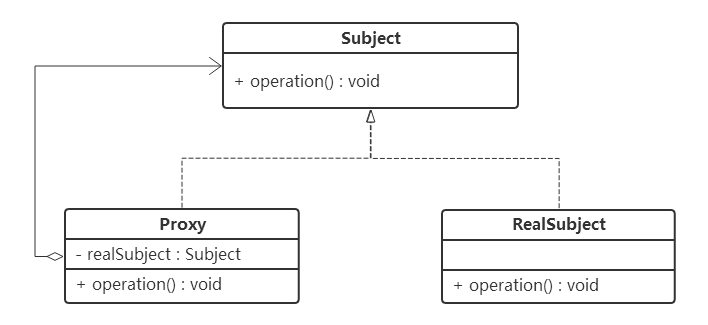
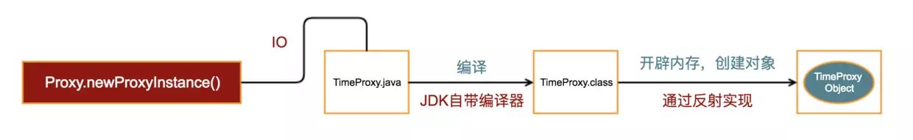
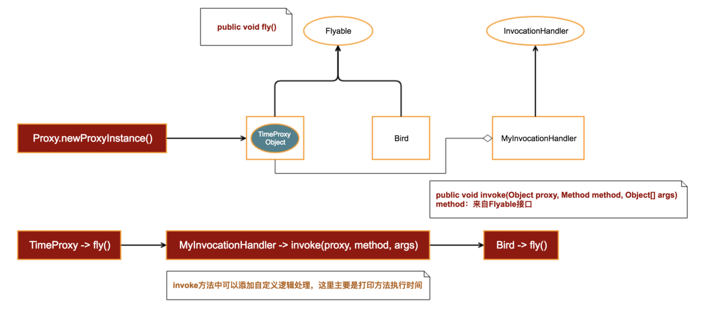

# 代理原理
## 定义
**为其他对象提供一个代理对象，并由代理对象控制这个对象的访问**
## 特点
1. 很直接的，实现同一个接口或者继承同一个抽象类
2. 代理对象控制对呗代理对象的访问


   - 抽象主题角色：定义了被代理角色和代理角色的共同接口或者抽象类。
   - 被代理角色：实现或者继承抽象主题角色，定义实现具体业务逻辑的实现。
   - 代理角色：实现或者继承抽象主题角色，持有被代理角色的引用，控制和限制被代理角色的实现，并且拥有自己的处理方法（预处理和善后）

首先是抽象主题角色：
```java
public interface Subject {
    public void movie();
}
```
很简单，单纯定义了movie方法，下面看被代理角色的实现：
```java
public class Star implements Subject {
    @Override
    public void movie() {
        System.out.println(getClass().getSimpleName() + "：经纪人接了一部电影，我负责拍就好");
    }
}
```
被代理角色实现抽象主题角色，专注实现被代理角色的业务逻辑。继续看代理角色：
```java
public class Agent implements Subject {
    private Subject star;

    public Agent(Subject star) {
        this.star = star;
    }

    @Override
    public void movie() {
        System.out.println(getClass().getSimpleName() + "：剧本很好，这部电影接下了");
        star.movie();
    }
}
```
代理角色持有被代理角色的引用，**要访问被代理角色必须通过代理**，负责被代理角色本职之外的职能，并且具有准入和过滤的功能。最后来看客户端的实现：
```java
public class Client {
    public static void main(String[] args) {
        Subject star = new Star();
        Subject proxy = new Agent(star);
        proxy.movie();
    }
}
```
表面上是调用了代理的方法，实际的执行者其实是被代理角色Star，看看结果就知道：
>Agent：剧本很好，这部电影接下了

>Star：经纪人接了一部电影，我负责拍就好
下面看代理模式的另一种实现方式，先看抽象主题角色代码：
```java
public interface Subject {
    public void movie();

    // 指定代理
    public Subject getAgent();
}
```
增加了指定代理的方法getAgent，再来看被代理角色和代理角色代码：
```java
// 被代理角色
public class Star implements Subject {
    @Override
    public void movie() {
        System.out.println(getClass().getSimpleName() + "：经纪人接了一部电影，我负责拍就好");
    }

    @Override
    public Subject getAgent() {
        return new Agent(this);
    }
}

// 代理角色
public class Agent implements Subject {
    private Subject star;

    public Agent(Subject star) {
        this.star = star;
    }

    @Override
    public void movie() {
        System.out.println(getClass().getSimpleName() + "：剧本题材很好，这部电影接下了");
        star.movie();
    }

    @Override
    public Subject getAgent() {
        return this;
    }
}
```
重点看被代理角色getAgent方法，方法里面指定了Agent为代理，而Agent的getAgent并没有指定代理。下面看客户端代码实现：
```java
public class Client {
    public static void main(String[] args) {
        Subject star = new Star();
        Subject proxy = star.getAgent();
        proxy.movie();
    }
}
```
在客户端通过getAgent得到指定代理角色，由代理来控制star对象。

运行的结果的跟上一种方式是一样的。注意，这种方式是客户端直接访问被代理角色，代理由被代理角色指定。前面的一种方式则是客户端不能访问直接访问被代理角色，只能访问代理。但是，无论是哪一种方式，代理模式的实现都是必须经过代理才能访问被代理模式。就比如明星拍电影，不会跳过经纪人直接找到明星，而是经过经纪人再到明星，要不然经纪人这个职位岂不是浪费了。
# 静态代理
```java
//为了记录小鸟飞行的时间
//采用聚合的方法
public class Bird implements Flyable {
    //传入一个小鸟对象，调用它的fly方法，然后记录这个过程(可以免去开辟栈内存、压栈、出栈等操作的时间)
    private Bird bird;

    public Bird(Bird bird) {
        this.bird = bird;
    }

    @Override
    public void fly() {
        long start = System.currentTimeMillis();

        bird.fly();

        long end = System.currentTimeMillis();
        System.out.println("Fly time = " + (end - start));
    }
}
```
但是当有多个需求需要去测量时，会有以下两个局限性：
* 如果同时代理多个类，依然会导致类无限制扩展
* 如果类中有多个方法，同样的逻辑需要反复实现
# 动态代理
动态代理开始时：



动态代理完成后，整个方法栈的调用栈：



JDK动态代理(**底层通过反射实现**)
```java
//InvocationHandler为JDK提供
Proxy.newProxyInstance(classloader,interfaces,InvocationHandler(){
    Object invoke(proxy,method,args){
        Object obj = method.invoke(被代理的对象,参数);
        return obj;
    }
});
```
Cglib动态代理(**底层通过继承实现**)
```java
//InvocationHandler为Spring提供
Enhancer.create(被代理类.class,InvocationHandler(){
    Object invoke(proxy,method,args){
        Object obj = method.invoke(被代理的对象,参数);
        return obj;
    }
});
```
# 使用
* Proxy->newProxyInstance(infs, handler) 用于生成代理对象
* InvocationHandler：这个接口主要用于自定义代理逻辑处理
* 为了完成对被代理对象的方法拦截，我们需要在InvocationHandler对象中传入被代理对象实例

# 一些问题
**invoke方法的第一个参数proxy到底有什么作用？**

这个问题其实也好理解，如果你的接口中有方法需要返回自身，如果在invoke中没有传入这个参数，将导致实例无法正常返回。在这种场景中，proxy的用途就表现出来了。简单来说，这其实就是最近非常火的链式编程的一种应用实现

**动态代理到底有什么用？**

使用动态代理可以让我们在不改变源码的情况下，直接在方法中插入自定义逻辑。这种编程模型有一个专业名称叫 AOP。所谓的AOP，就像刀一样，抓住时机，趁机插入

基于这样一种动态特性，我们可以用它做很多事情，例如：

* 事务提交或回退（Web开发中很常见）
* 权限管理
* 自定义缓存逻辑处理
* SDK Bug修复 ...


